# **广州市通用技术学业水平考试2021年A卷**

**一、单项选择题（共24题，每题2.5分，共60分）**

1．汽车技术涉及机械、材料、电子、计算机等多学科知识，这体现了技术的（   ）

A．目的性    B．实践性

C．综合性    D．创新性

标准答案：C

试题ID：10000002

2．下列关于技术与人、社会、自然的关系说法不正确的是（   ）

A．技术能改变人们的生产方式、生活方式、工作方式

B．技术不断推动着社会的发展和人类的进步

C．技术可以帮助人们保护自然

D．人们可以使用技术改造自然，因此不需要保护环境

标准答案：D

试题ID：10000003

3．某小组进行技术实践活动，设计了一款家具。该设计过程主要有以下几个环节：①发现与明确问题；②测试与优化；③制作模型或原型；④制订设计方案。正确的顺序是（   ）

A．②③④①    B．①④③②

C．③①②④    D．①③②④

标准答案：B

试题ID：10000004

4．某同学拟设计一款供老人使用的多功能拐杖。在开始设计之前，需要进一步明确问题。下列说法或做法不正确的是(　　)

A．向社区老人发放调查问卷，以明确设计需求

B．设计者的知识水平不是制约设计能力的因素

C．向专业人士请教相关技术问题

D．要考虑该设计的投入成本和资金来源

标准答案：B

试题ID：10000005

5．某同学设计制作台灯时，电源接口采用了通用串行总线（USB），这体现了设计的（   ）

A．科学性原则    B．时效性原则

C．安全性原则    D．标准化原则

标准答案：D

试题ID：10000006

6．如下表所示为两款多功能书桌的方案评价表，下列说法错误的是(    )

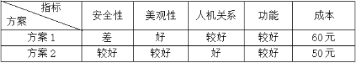

A．方案1的成本比方案2的高

B．方案2的功能比方案1的更优

C．方案1的美观性比方案2的更优

D．方案2的整体评价比方案1更优

标准答案：B

试题ID：10000007

7．下图是某工件的轴测图，该工件三视图正确的是（   ）

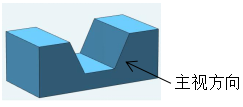

A．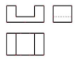

B．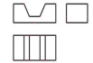

C．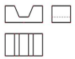

D．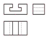

标准答案：C

试题ID：10000008

8．下列机械图中尺寸标注错误的是（   ）

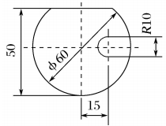

A．50

B．15

C．R10

D．

标准答案：C

试题ID：10000009

9．下列电子元器件图形符号与名称不一致的是（   ）

A．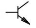

三极管

B．

电容器

C．

发光二极管

D．

电压表

标准答案：C

试题ID：10000010

10．下列工具使用方法不正确的是（   ）

A．使用钢锯起锯时施加压力要适当, 往复行程要短, 起锯角度不超过15°

B．使用锉刀锉削金属时不能用嘴吹碎屑

C．使用钢锯正常锯割时，前推不对锯弓施加压力，后拉对锯弓施加压力

D．使用台钻时不允许戴手套，女生长发塞工作帽内，并戴防护眼镜

标准答案：C

试题ID：10000011

11．某同学要制作一款木质手机支架，需要把两个木质零件连接组装，错误的装配工艺是（   ）

A．榫接    B．钉接

C．焊接    D．粘接

标准答案：C

试题ID：10000012

12．下列材料中易加工、绝缘、隔热的是（   ）

A．玻璃    B．合金

C．陶瓷    D．木材

标准答案：D

试题ID：10000013

13．对飞机模型进行风洞试验属于（   ）

A．对比试验    B．模拟试验

C．实物试验    D．计算机仿真试验

标准答案：B

试题ID：10000014

14．专利可以保护技术创新，依据我国专利相关法规，下列说法不正确的是（   ）

A．申请专利可向国家知识产权局提交申请文件

B．专利不仅可以防止科技成果的流失，而且有利于科技进步和经济发展

C．我国专利包括发明专利、实用新型专利和外观设计专利

D．专利的保护是永久的，没有时间期限

标准答案：D

试题ID：10000015

15．如图所示是山西应县木塔，该塔是当今世界现存最高的木结构建筑。它处于大同盆地地震带上，在近千年的历史中，木塔经历了多次大地震却安然无恙。下列选项中，从文化角度对应县木塔的结构进行欣赏和评价的是（   ）

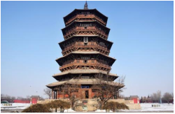

A．塔身横截面逐层缩小，有效地提升了塔的稳定性

B．所有柱子之间砌筑都有厚实的墙体，牢牢地“抱”住各柱子，增加了构架的整体强度

C．木塔内梁与柱的连接完全通过斗拱完成，各种构件通过榫卯连接，是木结构经典建筑

D．应县木塔的设计，继承了汉、唐以来富有民族特色的重楼形式，是一座有民族风格和特色的建筑

标准答案：D

试题ID：10000016

16．如图所示A形铝梯的中间横梁有助于提高梯子稳定性，其主要原因是（   ）

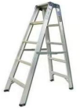

A．将梯子所受的压力均匀扩散

B．大大降低了梯子的重心

C．运用了三角形的稳定性

D．增大了梯子的支撑面积

标准答案：C

试题ID：10000017

17．拔河比赛时绳子受到外力作用发生（   ）

A．弯曲变形    B．拉伸变形

C．剪切变形    D．挤压变形

标准答案：B

试题ID：10000018

18．如图所示的陶茶壶，其制作工艺流程是：材料制备→拉坯塑型→修坯→雕刻→焙烧成陶→打磨抛光。关于该流程的说法不合理的是（   ）

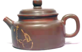

A．打磨抛光环节不可以省略

B．拉坯塑型环节可以再作为单一流程细分多个环节

C．各个环节按照一定的时间顺序完成

D．雕刻环节可以和焙烧成陶环节调换

标准答案：D

试题ID：10000019

19．如图所示，把风扇部件拆下来清洗后，现需将扇叶和前后网罩装回去，包含以下步骤：①拧紧后网罩固定螺母圈；②对准相应孔安装后网罩；③拧紧固定扇叶的螺母圈；④安装扇叶；⑤安装前网罩，拧紧螺母。正确操作流程是（    ）

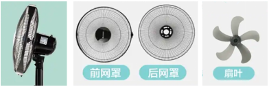

A．①②③④⑤    B．②①④③⑤

C．④③②①⑤    D．②①⑤④③

标准答案：B

试题ID：10000020

20．如图所示是某同学做饭的流程图，总耗时47分钟。现对该流程的时序进行并行优化，完成所有工序的最短时间是（   ）

A．37分钟    B．32分钟

C．27分钟    D．22分钟

标准答案：C

试题ID：10000021

21．下列关于系统的描述正确的是（   ）

①构成系统至少要有两个或两个以上的要素，且要素之间相互联系、相互作用；

②按系统组成元素的性质，系统可以分为自然系统、人工系统和复合系统；

③系统是具有一定结构和功能的有机整体；

④系统优化时，对应不同的优化目标，可以得到不同的优化结果。

A．①②③    B．②③④

C．①③④    D．①②③④

标准答案：D

试题ID：10000022

22．系统的优化是在一定的条件下，使系统达到更理想、更佳效果的过程。以下事例不能使系统达到优化的是（   ）

A．把某城市交通系统升级为城市智慧交通系统

B．为了提高芒果产量，树种得越密越好

C．利用农作物生长的季节差、时间差进行间作套种

D．在耕地少的地区开发低丘缓坡，建立经济林基地

标准答案：B

试题ID：10000023

23．如图所示，红外线感应水龙头检测到有手靠近时出水，延迟几秒钟后关水。该控制系统属于（   ）

A．手动控制、开环控制    B．手动控制、闭环控制

C．自动控制、开环控制    D．自动控制、闭环控制

标准答案：C

试题ID：10000024

24．下列关于控制系统的说法，不正确的是（   ）

A．有传感器的控制系统就是闭环控制系统

B．将控制器发出的信号转换成能影响被控对象的信号的装置称为执行器

C．执行器发出的控制信号称为控制量

D．能引起被控量发生变化的因素不一定都是干扰因素

标准答案：A

试题ID：10000025

**二、综合题（共4题，每题10分，共40分）**

（一）

25．某设计师发现学生课桌收纳空间不足，设计了一款如图所示的“桌边置物架”。为确定尺寸，收集了中学生坐姿时的手肘高度、前后桌距离、同桌最舒适间距等数据。该置物架采用金属制造，长37.5cm、宽16.5cm、高72.1cm。请根据以上材料，回答下列问题：

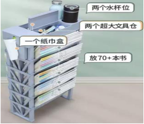

（1）“桌边置物架”设计问题的来源是（   ）；

A．人类生存的需要    B．用户指定的问题

C．生活中实际问题

标准答案：C

（2）设计师确定“桌边置物架”尺寸遵循的是（   ）；

A．工程心理学和生理学原则    B．可靠性和耐用性原则

C．可持续发展原则    D．时效性原则

标准答案：A

（3）在制作过程中，主要用到（   ）；

A．电子制作工艺    B．金属加工工艺

C．木工加工工艺    D．塑料加工工艺

标准答案：B

（4）制作完成后，需要进行功能技术试验，并填写技术试验报告。下列不属于技术试验报告内容的是（   ）；

A．试验目的    B．试验设备

C．试验原理    D．试验结果猜测

标准答案：D

（5）在编写产品使用说明书时，不需要的内容是（   ）。

A．特点与功能    B．使用注意事项

C．产品制造方法    D．安装说明

标准答案：C

试题ID：10000026

（二）

26．如图所示为某工厂生产的一款实木儿童椅子，椅面可随儿童成长调节高度。请观察和分析其结构特点，回答下列问题： 

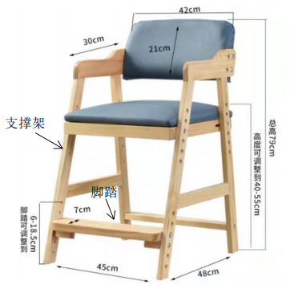

（1）该椅子上部窄下部宽，这样设计主要是考虑它的\_\_\_\_\_\_（稳定性/强度)；

标准答案：稳定性

（2）椅面高度可随儿童成长调节，椅面与支撑架的连接方式应采用\_\_\_\_\_\_（焊接/螺栓连接/胶接)；

标准答案：螺栓连接

（3）该椅子包含榫卯结构，制作榫卯结构的环节有：①做榫头；②合榫；③开榫眼；④划线。最合理的制作流程是（   ）；

A．④①③②    B．③④①②

C．④③②①    D．①④②③

标准答案：A

（4）开榫眼时应采用的加工工艺是\_\_\_\_\_\_(锯割/刨削/凿削)，使用的工具是\_\_\_\_\_\_(木锯/刨子/木工凿)。

标准答案：凿削；木工凿

试题ID：10000032

（三）

27．如图所示为某谷物烘干系统工艺流程图，请根据该流程图回答下列问题：

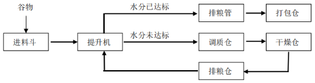

（1）某批次谷物经提升机里的水分检测仪检测，如水分未达标，提升机环节的下一个环节是\_\_\_\_\_\_（调质仓/排粮管）；

标准答案：调质仓

（2）关于该谷物烘干工艺流程说法不正确的是（   ）；

A．提升机环节具有谷物分流作用

B．调质仓、排粮仓两个环节同时进行

C．水分未达标的谷物需干燥处理

D．在打包仓完成谷物打包

标准答案：B

（3）关于谷物烘干流程的优化，下列说法不正确的是（   ）；

A．流程优化要充分把握事物的内在规律和机理

B．流程优化有助于提高生产效率和产品质量

C．为了缩短工期，可以改造或更新设备

D．流程优化只能通过合并环节实现

标准答案：D

（4）运行过程中发现水分未达标的谷物过多时，系统会来不及处理，以下措施能解决该问题的是（   ）；

A．提升干燥仓的干燥能力    B．增大进料斗容量

C．提高打包的工作效率    D．加快排粮管的排粮速度

标准答案：A

（5）流程优化的步骤有：①流程改进的实施；②确定优化的方案；③确定优化的目标和要求；④分析流程的现状。正确的顺序是（   ）。

A．①②④③    B．②①④③

C．④③②①  D．④③①②

标准答案：C

试题ID：10000037

28．某饮水机的工作原理是：温度传感器检测水的温度，然后将温度信息传给电子控制器。如果温度低于预设温度时，电子控制器发出信号给继电器，继电器接通加热器的电路，加热器开始加热。当水温达到预设温度后继电器断开电路，加热器停止加热。请根据以上材料，回答下列问题：

（1）该控制系统属于\_\_\_\_\_\_（手动/自动）控制系统；

标准答案：自动

（2）该控制系统属于\_\_\_\_\_\_（开环/闭环）控制系统；

标准答案：闭环

（3）该饮水机控制系统的温度传感器属于\_\_\_\_\_\_（控制器/执行器/反馈环节），被控量是\_\_\_\_\_\_（水温/电流）；

标准答案：反馈环节；水温

（4）该饮水机控制系统，如果温度传感器失灵了，必须维修或更换，否则饮水机无法正常运行，这体现了系统的\_\_\_\_\_\_（整体性/环境适应性）。

标准答案：整体性

试题ID：10000043
