# **广州市通用技术学业水平考试2021年B卷**

**一、单项选择题（共24题，每题2.5分，共60分）**

1．下列关于技术的说法正确的是(　　)

A．技术的主要任务是认识世界

B．技术最早源于人类生存的基本需要

C．技术解决“是什么”“为什么”的问题

D．技术的发展与设计无关

标准答案：B

试题ID：10000048

2．下列关于技术与自然的关系说法不正确的是(　　)

A．随着技术的发展，人们越来越重视技术对自然的影响

B．技术发展可以帮助人们保护自然

C．人们利用技术一定可以战胜自然

D．人们使用技术时应尊重自然规律

标准答案：C

试题ID：10000049

3．产品设计制作的过程通常包含以下环节：①制订设计方案；②制作模型或原型；③发现与明确问题；④测试与优化。上述环节正确的时序是(　　)

A．①③②④    B．③①②④

C．③①④②    D．①③④②

标准答案：B

试题ID：10000050

4．为了确定某款学习机最佳的屏幕尺寸，设计师在设计前期进行广泛的调查，这种活动属于（   ）

A．信息收集和整理    B．心理测试

C．成本核算    D．设计的构思

标准答案：A

试题ID：10000051

5．某品牌洗衣机设置了四道防护措施：断电保护、门锁保护、儿童锁保护、开门保护，这体现了技术设计的(　　)

A．安全性原则    B．工程心理学和生理学原则

C．可持续发展原则    D．标准化原则

标准答案：A

试题ID：10000052

6．某同学对小板凳的三个设计方案进行评价，结果如下表所示。下列选项中说法正确的是(    )

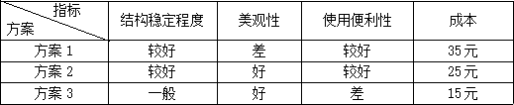

A．方案1的成本最低

B．方案1的美观程度优于方案3

C．方案2整体评价比方案1更优

D．三个方案的结构稳定程度一样

标准答案：C

试题ID：10000053

7．下图是某工件的轴测图，该工件三视图正确的是(　　)

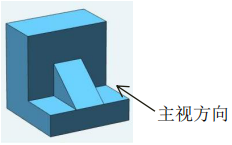

A．

B．

C．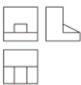

D．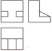

标准答案：C

试题ID：10000054

8．以下机械图中尺寸标注错误的是(　　)

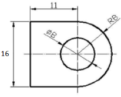

A．R8

B．

C．16

D．11

标准答案：C

试题ID：10000055

9．下列电子元器件图形符号与名称不一致的是（   ）

A．

三极管

B．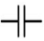

电池

C．

发光二极管

D．

电阻器

标准答案：B

试题ID：10000056

10．用木料加工如下图所示的榫头和榫眼时，需要用到的工具组合最合理的是（   ）

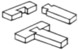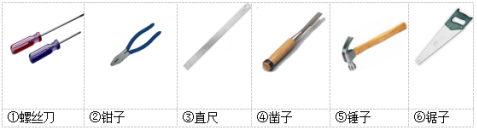

A．③④⑤⑥    B．①②③⑥

C．②③⑤⑥    D．②③④⑥

标准答案：A

试题ID：10000057

11．下列制作模型的环节中，第一个步骤是（   ）

A．表面涂饰    B．制作准备

C．零件加工    D．产品装配

标准答案：B

试题ID：10000058

12．下列选项中属于新型材料的是（   ）

A．玻璃    B．塑料

C．铝合金    D．纳米材料

标准答案：D

试题ID：10000059

13．在设计制作广告宣传灯时，选择宣纸、纱布、塑料膜等材料做灯罩材料透光试验。该灯罩材料透光试验属于（   ）

A．力学试验    B．模拟试验

C．计算机仿真试验    D．对比试验

标准答案：D

试题ID：10000060

14．根据我国专利相关法规，下列说法正确的是（   ）

A．只要向国家知识产权局提交申请文件就能被授予专利

B．专利的保护是永久的，没有时间期限

C．专利可以保护技术创新

D．我国专利只包括发明专利和外观设计专利

标准答案：C

试题ID：10000061

15．下列物体属于实体结构的是（   ）

A．乒乓球    B．头盔

C．长城    D．贝壳

标准答案：C

试题ID：10000062

16．家用落地风扇底座设计得比较大、比较重，其结构稳定的原因是（   ）

A．重心低，支撑面积大    B．重心低，支撑面积小

C．重心高，支撑面积大    D．重心高，支撑面积小

标准答案：A

试题ID：10000063

17．用绳子绑着桶在井中提水时，绳子受到外力作用发生（   ）

A．拉伸变形    B．弯曲变形

C．剪切变形    D．挤压变形

标准答案：A

试题ID：10000064

18．下列关于流程的说法错误的是（    ）

A．不可颠倒的时序往往反映事物的内在规律

B．任何环节之间的时序都可以调整

C．合理的流程能指导我们做事

D．有些环节可包含与其相应的子流程

标准答案：B

试题ID：10000065

19．指纹锁的工作原理是通过读取指纹图像的特征进行身份识别。用户使用指纹开门时，指纹锁的工作流程可以分为几个环节：①采集开门人的指纹图像；②处理指纹图像；③控制门锁是否开启；④检验指纹图像特征是否匹配；⑤读取数据库中已有的指纹图像特征。该工作流程正确的时序是（   ）

A．①②⑤④③    B．①⑤④②③

C．⑤①②④③    D．①②④⑤③

标准答案：A

试题ID：10000066

20．如图所示是某工厂制作广告宣传灯的流程图，总耗时9.5小时。现对该流程的时序进行并行优化，完成所有工序的最短时间是（    ）

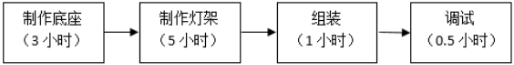

A．8.5小时    B．4.5小时

C．6.5小时    D．5.5小时

标准答案：C

试题ID：10000067

21．2021年10月16日，我国神舟十三号载人飞船成功发射，完成与天和核心舱对接。天和核心舱是一个复杂的系统，该系统属于（    ）

A．实体系统、人工系统    B．抽象系统、人工系统

C．实体系统、自然系统    D．抽象系统、自然系统

标准答案：A

试题ID：10000068

22．下列关于系统优化说法不正确的是（    ）

A．系统优化受一定条件影响和约束

B．系统的优化是不断验证、完善的过程

C．系统优化时要注重系统组成部分之间、组成部分与整体之间的协调

D．系统的各个组成元素都最优，系统的整体就一定最优

标准答案：D

试题ID：10000069

23．某恒温加热炉的温度控制系统如图所示，其中热电偶用于检测加热炉内部温度，该控制系统属于（    ）

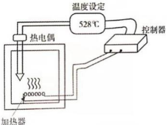

A．自动控制、开环控制    B．自动控制、闭环控制

C．手动控制、开环控制    D．手动控制、闭环控制

标准答案：B

试题ID：10000070

24．如图所示为某交通路口红绿灯控制系统的方框图。在该控制系统中，执行器是（    ）

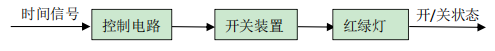

A．控制电路    B．红绿灯的开关状态

C．开关装置    D．红绿灯

标准答案：C

试题ID：10000071

**二、综合题（共4题，每题10分，共40分）**

（一）

25．某同学发现父母出差时烘干衣服不便，于是设计了一款可折叠的干衣机。如图所示，折叠后便于携带，展开后可以烘干衣服。请根据以上材料，回答下列问题：

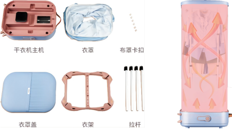

（1）该设计问题的来源是（    ）；

A．人类生存必须解决的问题    B．用户指定的问题

C．设计者主动发现的问题

标准答案：C

（2）为了避免烘干部件温度过高引发危险，设计了温控保护，该设计遵循的是（    ）；

A．经济性原则    B．标准化原则

C．安全性原则

标准答案：C

（3）加工金属拉杆的操作过程，不正确的是（    ）；

A．使用钢锯起锯时，起锯角度约15度

B．使用锉刀锉削金属时，不能用嘴吹碎屑

C．使用钢锯向后拉锯时，不需施加压力

D．使用钢锯正常锯割时可单手握锯，快速推拉

标准答案：D

（4）干衣机制作完成后，不需要做的测试是（    ）；

A．结构稳定性测试    B．衣罩遮光性测试

C．拉杆抗弯性测试    D．烘干效果测试

标准答案：B

（5）在编写产品使用说明书时，不需要的内容是（    ）。

A．使用注意事项    B．产品制造方法

C．安装方法    D．产品特点介绍

标准答案：B

试题ID：10000072

（二）

26．如图所示为一款某工厂生产的可调高度的实木桌子，观察和分析其结构，回答下列问题：

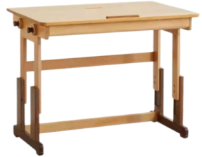

（1）该桌子包含榫卯结构，制作榫卯结构的环节有：①做榫头；②开榫眼；③合榫；④划线。最合理的制作流程是（    ）；

A．④①②③    B．②④①③

C．④②③①    D．①④③②

标准答案：A

（2）在加工桌腿时，为使桌腿表面平整，应采用的加工工艺是\_\_\_\_\_\_(锯割/刨削/凿削)，使用的工具是\_\_\_\_\_\_(木锯/刨子/木工凿)；

标准答案：刨削；刨子

（3）桌子高度可调节，桌腿调节处合适的连接方式应采用\_\_\_\_\_\_（钉接/螺栓连接/粘接)；

标准答案：螺栓连接

（4）如果将该桌子桌腿材料由松木替换为不锈钢，主要可以提高它的\_\_\_\_\_\_（稳定性/强度)。

标准答案：强度

试题ID：10000078

（三）

27．某造纸厂运用水力碎浆、铝塑复合物分离等技术，实现了废弃奶盒的循环利用。请根据如图所示的废弃奶盒回收生产流程图，回答下列问题：

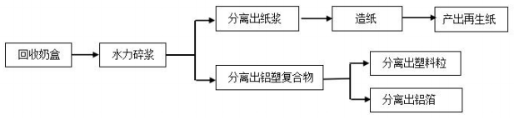

（1）根据废弃奶盒回收生产流程图，下列说法不正确的是（    ）；

A．水力碎浆和造纸两个环节的时序可以颠倒

B．分离出的纸浆是再生纸的原料，实现了资源再利用

C．水力碎浆环节在分离出铝塑复合物环节之前

D．该流程的产物有再生纸、塑料粒和铝箔

标准答案：A

（2）废弃奶盒回收生产流程最终产出再生纸等产品，该流程属于\_\_\_\_\_\_（工作流程/工艺流程）；

标准答案：工艺流程

（3）水力碎浆和造纸两个环节是\_\_\_\_\_\_（同步进行/先后进行）；

标准答案：先后进行

（4）该流程中铝塑复合物可以分离出\_\_\_\_\_\_（再生纸/塑料粒）；

标准答案：塑料粒

（5）要对废弃奶盒回收生产流程进行优化，下列流程优化的步骤中最后一步是（    ）。

A．确定优化的方案    B．分析流程的现状

C．确定改进的目标和要求 D．流程改进的实施

标准答案：D

试题ID：10000083

（四）

28．如图所示为一款防汛报警控制系统，包括警戒水位检测装置、电磁铁控制电路和报警电路。水位上涨，浮球上浮。当达到警戒水位时，金属导电板在浮球推动下上移，使电磁铁控制电路接通，在电磁铁吸力的作用下报警电路的触点开关闭合，报警电路中的报警器发出报警声。

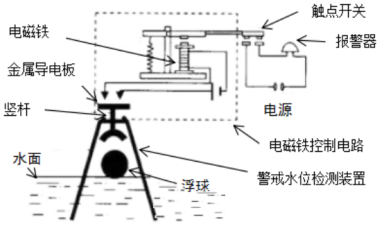

（1）该控制系统属于\_\_\_\_\_\_（手动/自动）控制系统；

标准答案：自动

（2）该控制系统属于\_\_\_\_\_\_（开环/闭环）控制系统；

标准答案：开环

（3）该防汛报警控制系统中报警器是\_\_\_\_\_\_（控制器/执行器/被控对象）；

标准答案：被控对象

（4）可对该控制系统灵敏度造成干扰的因素是\_\_\_\_\_\_（风/声音）；

标准答案：风

（5）上述控制系统中，如果金属导电板失灵了，必须维修或更换，否则该防汛报警控制系统就不能正常工作，这体现了系统的\_\_\_\_\_\_（整体性/环境适应性）。

标准答案：整体性

试题ID：10000089
