# **广州市通用技术学业水平考试2022年A卷**

**一、单项选择题（共24题，每题2.5分，共60分）**

1\.某款即热式饮水机，热水无需等待，即按即出。关于该饮水机下列说法不正确的是（　）

A.能满足人们随时喝到热水的需求，体现了技术的目的性

B.与传统饮水机相比，避免将水反复烧开，体现了技术的创新性

C.比普通饮水机价格高，体现了技术应用具有两面性

D.即热式饮水机应用了多项技术，体现了技术的综合性

标准答案：C

2\.2022年9月3日，我国自主研制的大型太阳能无人机“启明星50”在陕西榆林首飞成功。关于该无人机下列说法不正确的是（　）

A.    可应用在高空侦察、森林火情监测、大气环境监测、地理测绘、通信中继等方面，对促进社会发展、环境保护等产生巨大的作用

B.该无人机的研发推动了我国新能源、复合材料、飞行控制等技术的发展

C.使用太阳能作为能源，体现了可持续发展的理念

D.代替人们开展巡护作业，会让人变得更懒，阻碍人的发展

标准答案：D

3\.某同学想为老人设计一款可穿戴跌倒报警装置，在明确了设计问题后，按照技术设计的一般过程，下一步应该进行的是（　）

A.制作模型或原型

B.制订设计方案

C.测试与优化

D.发现问题

标准答案：B

4\.某同学发现冰箱里的食物因忘记食用而过期变质，于是他想设计一款食物保质期提醒器，在开始设计之前，需要进一步明确设计问题。下列说法或做法不正确的是（　）

A. 通过查阅文献和互联网检索，了解有无相同或类似产品

B. 设计者的知识水平不是制约设计能力的因素

C. 考虑设计使用的原材料和工具设备是否得到满足

D. 设计产品时受到时间、成本、环境等因素的约束
   
   标准答案：B
   
   5\.如图所示为一款带小夜灯的多功能转换插座，关于该转换插座的设计，下列说法不正确的是（　）
   
   

A. 将单插位转换为多插位，遵循了设计的实用性原则

B. 插座面板的电源孔位尺寸符合国家标准，遵循了设计的标准化原则

C. 采用小夜灯和插座组合设计，遵循了设计的创新性原则

D. 美观耐用，遵循了设计的安全性原则
   
   标准答案：D
   
   6\.广州海心桥设计时，共征集到几十个设计方案，经层层选拔，最终选定了以"琴鸣绢舞·岭南花舟"为主题的设计方案，这个过程属于（　）

A. 方案的构思

B. 方案的制订

C. 方案的改进

D. 方案的比较、权衡和决策
    
    标准答案：D
    
    7\.根据如图所示立体图，其三视图中缺少的图线有（  ）
    
    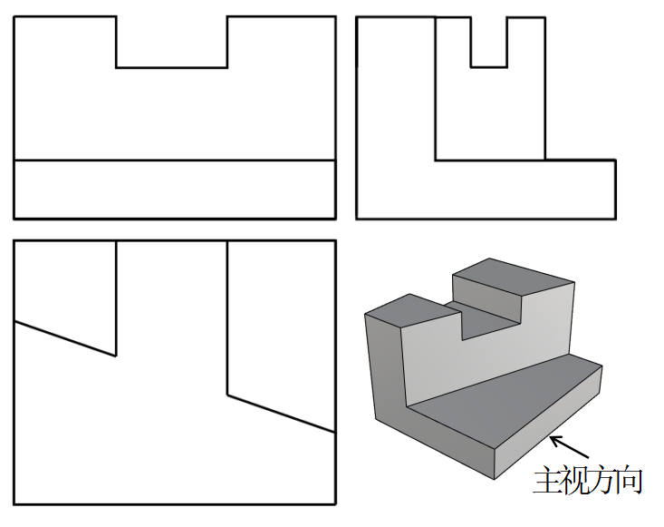
    
    A.1条              B.2条              C.3条              D.4条
    
    标准答案：C
    
    8\.如图所示机械制图，尺寸标注错误的有（　）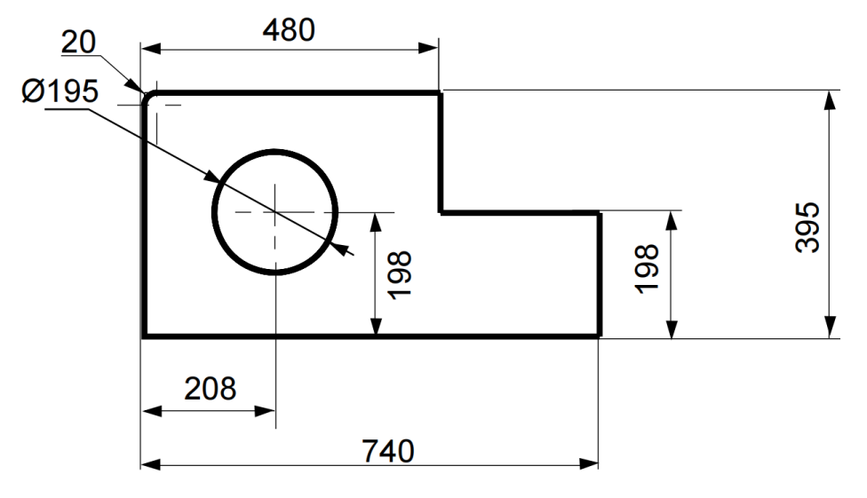
    
    A.1处              B.2处              C.3处              D.4处
    
    标准答案：B

| 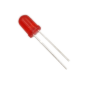 | 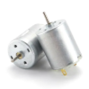 |  | 
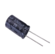

 |
|:-----------------------------------------------------------------------------------------------------------------------------------------------------------:|:-----------------------------------------------------------------------------------------------------------------------------:|:-----------------------------------------------------------------------------------------------------------------------------:|:-------------------------------------------------------------------------------------------------------------------------------------------------------------------------:|
| A.                                                                                                                                                          | B.                                                                                                                            | C.                                                                                                                            | D.                                                                                                                                                                        |

   9\.下列实物与电子元器件图形符号不一致的是（　）

   标准答案：A

   10\.用厚度为 5mm 的钢板制作如图所示零件，下列说法不正确的是（　）

   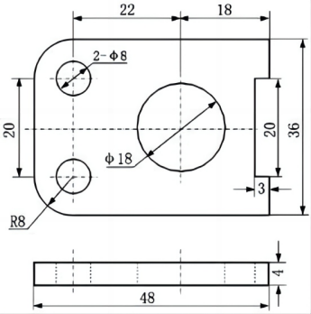

A. 锯割时可戴手套\
   B. 锉削时可用半圆锉锉削\
   C. 加工流程为：划线→钻孔→锯割→锉削\
   D. 加工Φ8圆孔，应先用样冲冲眼，然后用划规划出圆心再钻孔
   
   标准答案：D

11. 木工工艺制作如下图所示榫眼时，不需要的工具是（　）
   
   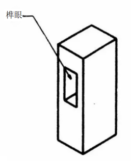

A. 角尺    B. 手钢锯\
C. 凿子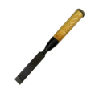    D. 锤子

标准答案：B

12\.某学校举办“风车设计与制作”比赛，组委会提供了下列材料，其中不属于标准件的是（  ）

A.5mm自攻螺钉          B.内径Φ6mm垫圈       

C.15×15×300mm方木料    D.内径Φ6mm轴承

标准答案：C

13\.在发射神舟五号载人飞船前，我国先后发射了神舟一号至神舟四号无人试验飞行器。下列关于技术试验说法正确的是（ ）

A. 神舟五号研发过程中不需要进行计算机仿真试验  　　　　
B. 技术试验是技术设计中的一个重要环节
C. 为节约成本，无需进行无人飞行试验   　
D. 技术试验一定会阻碍设计的进程               

标准答案：B

14\.酒精消毒剂产品说明书不需要包含的内容是（  ）

A. 化学成分    
B. 使用方法    
C. 保存方法    
D. 生产工艺

标准答案：D

15\.结构有实体结构、框架结构、壳体结构三种基本类型，下列结构的类型有别于其他三项的是（  ）    

A.                   B.               C.        D.

标准答案：D

16\.为了提高如图所示桌子的稳定性，下列做法合理的是（  ）

A. 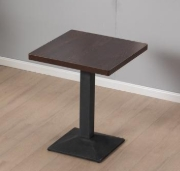增加桌面的厚度    
B. 增大底座的面积    
C. 增加支撑柱的高度               
D. 增大桌面的面积

标准答案：B

17\. 设计指示牌结构时需要考虑的因素有：①稳定性；②安全性；③美观；④强度；⑤民俗；⑥个性化需求等。为防止如图所示交通指示牌被大风刮倒或毁坏，重点考虑的因素是（　　）

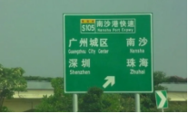

A. ①③④      B. ③⑤⑥      C. ①②④      D. ②⑤⑥
   
   标准答案：C
   
   18\.下列流程属于工作流程的是（  ）

A. 中学生请假流程

B. 制作木质手镯流程

C. 烧制陶器流程

D. 制作飞机模型流程

标准答案：A

19\.一般说来，工艺流程包括以下环节：①制作准备；②产品装配；③零件加工；④表面涂饰。其正确顺序是（  ）

A.①③②④       B.①②③④        C.①④②③     D.①④③②

标准答案：A

20\.如图所示为某厂广式月饼生产流程图，下列说法不正确的是（  ）

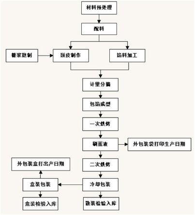

A. 饼皮制作与馅料加工是并行工序
B. 一次烘烤与刷蛋液是串行工序
C. 外包装袋打印生产日期与二次烘烤是并行工序
D. 包馅成型与计量分摘两个环节可以互换

标准答案：D

21\.055型驱逐舰是我国研制的新型防空驱逐舰，具有强大的探测能力和信息化作战能力，是中国海军未来的主力战舰。055型驱逐舰是一个复杂的系统，该系统属于（  ）

A. 抽象系统、自然系统    
B. 抽象系统、人工系统
C. 实体系统、人工系统    
D. 实体系统、自然系统

标准答案：C

22\.下列关于系统优化说法不正确的是（　）

A. 系统优化时要注重系统组成部分之间、组成部分与整体之间的协调
B. 系统优化是在给定条件下使系统获得更佳功能或效益的过程
C. 系统优化时每个元素一定要选择最优的
D. 系统优化受一定条件影响和约束

标准答案：C

23\.下列控制系统中，属于闭环控制系统的是（　）

A. 商场的自动门
B. 感应水龙头
C. 红绿灯定时控制系统
D. 孵化恒温箱

标准答案：D

24. 关于开环控制和闭环控制，下列说法不正确的是（  ）

A. 自动控制不一定是闭环控制

B. 闭环控制也可能受干扰影响

C. 开环控制一定没有检测装置

D. 闭环控制一定有检测装置
    
    `   `标准答案：C

**二、综合题（共4题，每题10分，共40分）**

（一）

25\.学校收集了很多学生优秀绘画作品，准备在校园艺术节展出。现需要同学们帮忙设计绘画作品宣传板及配套的连接件。学校对该设计提出以下几点要求：

①利用原有的路灯灯柱作为宣传板的立柱，灯柱上不能打孔，不能焊接；

②使用不锈钢制作宣传板与灯柱间的连接件；

③宣传板不能紧贴灯柱，与灯柱间隔100-200mm；

④宣传板安装需简单，高度可调，可拆卸。

某同学设计构思如图所示。

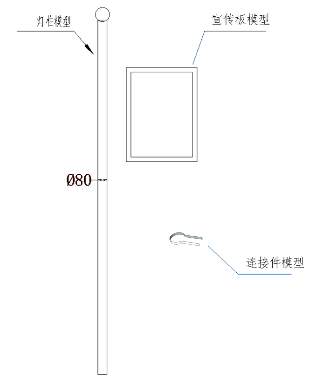

请同学们根据以上材料，回答下列问题：

（1）设计连接件时不需要考虑的因素是（  ）；

A.灯柱的直径       B.加工工艺

C.宣传板的重量     D.灯柱的价格

标准答案：D

（2）某同学采用的制图比例是1:20，但在进行尺寸标注时，由于粗心，漏标了一条线段。该线段在图纸上的长度是30mm，那么该线段应标注的长度为      mm；（填上正确的阿拉伯数字）

标准答案：600

（3）某同学选择用铝合金材料制作宣传板框架，现需要在宣传板框架上开两个安装孔，关于开孔操作的说法不正确的是（  ）；

A.开孔时需要先用样冲在待钻孔中心冲出浅凹窝

B.装夹工件时要使待开孔的平面与钻头成垂直关系

C.钻头大小要适合，钻头旋转时不能有摆动

D.钻孔的整个行程中，施加的进给力要始终保持一致

标准答案：D

（4）下列零件中，最适合用来将连接件固定在灯柱上的是（  ）；

A. 膨胀螺栓    B. 自攻螺钉\
C. 钉子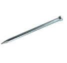    D. 螺栓和螺母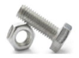

标准答案：D

（5）设计过程中，要进行一系列技术试验，下列技术试验合理的是（  ）

A.从高处抛下连接件，观察连接件是否损坏

B.对连接件进行耐高温测试

C.宣传板安装好后，用适当的力摇晃宣传板，检测其连接是否牢固

D.宣传板安装好后，用力撞击路灯灯柱，观察宣传板是否能承受晃动

标准答案：C

`   `（二）

26\.如图所示为某卸料小车结构示意图，摇杆下端与车架连接于A点，上端与挡料板连接于B点，挡料板在C点与料仓连接，料仓在D点与车架连接。**当向上抬起车架把手到一定高度时，摇杆绕A点逆时针转动**，**可实现料仓翻转与挡料板自动开启，**完成卸料。请同学们根据以上材料，回答下列问题：

（1）在卸料时，摇杆主要受力形式是\_\_\_\_\_\_\_(受压/受弯曲/受剪切)，料仓和挡料板的连接点C采用销钉连接, 卸料时销钉的主要受力形式是\_\_\_\_\_(受拉/受压/受剪切/受扭转)；

标准答案：受压，受剪切

（2）车架与料仓D连接点的连接方式是\_\_\_\_\_\_\_ (刚连接/铰连接)；

标准答案：铰连接

（3）小车在交付使用前，为了测试小车的性能，让小车装上物料在颠簸的路面上行驶，并完成卸料操作等试验，这种试验方法属于（  ）；

`　`Ａ. 实物试验　　Ｂ.模拟试验　　Ｃ.对比试验　　Ｄ.仿真试验

标准答案：A

（4）为了防止卸料时料仓翻转过度，要在料仓上增加一个限位销，这个限位销设计在\_\_\_\_\_\_(Ｅ/Ｆ)点较合适。

标准答案：Ｆ

（三）

27\.如图所示为某企业矿泉水生产流程图，请根据该流程图回答下列问题：

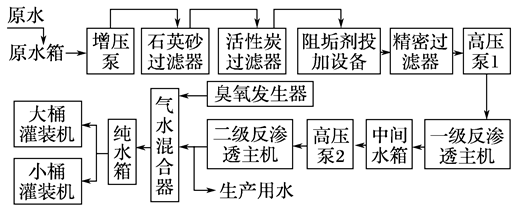

（1）该矿泉水生产流程属于\_\_\_\_\_\_\_\_\_\_（工作流程/工艺流程）；

标准答案：工艺流程

（2）二级反渗透主机与臭氧发生器是\_\_\_\_\_\_\_\_\_（串行工序/并行工序）；

`      `标准答案：并行工序

（3）根据该矿泉水生产流程图，下列说法正确的是（  ）；

A. 流程设计只需考虑环节

B. 原水先经过多次过滤处理后再进行反渗透处理

C. 得到生产用水需经过气水混合器杀菌处理

D. 该流程产出物只有大桶矿泉水和小桶矿泉水

标准答案：B

（4）如对该矿泉水生产流程进行优化，下列步骤中第一步是（  ）；

A. 确定优化的方案    B. 确定改进的目标和要求

C. 分析流程的现状    D. 流程改进的实施

标准答案：C

（5）关于该矿泉水生产流程的优化，下列说法不正确的是（  ）。

A. 为了缩短工期，可以改造或更新设备

B. 为了缩短工期，可以取消“气水混合器”这个环节

C. 流程优化要充分把握事物的内在规律和机理

D. 流程优化有助于提高生产效率和产品质量

标准答案：B

（四）

28. 如图1所示某款电煮茶器，盛装茶叶的滤网高于最大水位高度，不与水直接接触，而是利用水沸腾时产生的高温蒸汽喷淋在茶叶上完成烹煮。该煮茶器可以根据茶的种类设置水沸腾后的煮茶时间，并具备保温功能，其工作过程可分为以下四个阶段：
    
    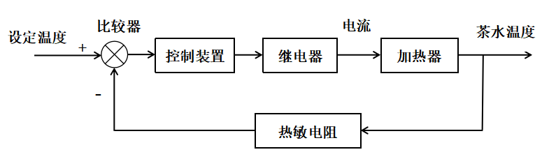

图1

①  准备阶段：煮茶之前，往煮茶器内加入适量水，滤网内加入茶叶，设置煮茶时间和保温温度；
②  加热阶段：按下"开始"键后，加热器将水由常温加热至沸腾；
③  蒸汽煮茶阶段：水沸腾后煮茶器的计时器开始计时，加热器继续加热让水保持沸腾，持续时间为预先设置的煮茶时间，计时结束后加热器停止加热；
④  保温阶段：可设置的保温温度为40℃到95℃之间的某个值，蒸汽煮茶阶段刚结束时茶水温度高于设定温度，加热器不工作，茶水温度在环境温度影响下逐渐下降。当茶水温度低于设定温度时加热器开始工作，将茶水加热至设定值，从而保持茶水温度恒定。保温阶段的控制系统框图如图2所示。

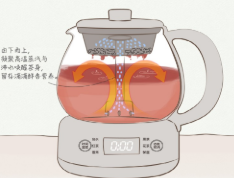

图2

请根据以上材料，回答下列问题：

（1）蒸汽煮茶阶段属于\_\_\_\_\_\_(手动/自动）控制，\_\_\_\_\_\_(开环/闭环）控制；

标准答案：自动，开环

（2）在保温阶段的控制过程中，加热器是（  ）；

A．被控量    B．被控对象

C．控制器    D．执行器

标准答案：B

（3）在保温阶段的控制过程中，茶水温度是（  ）；

A．被控量    B．被控对象

C．控制量                  D．执行器

标准答案：A

（4）以下不属于煮茶器保温控制系统的干扰因素的是（　）。

A．供电电压波动    B．打开盖子

C．室内温度大幅变化    D．调低设定的保温温度

标准答案：D

