# **广州市通用技术学业水平考试2022年B卷**

**一、单项选择题（共24题，每题2.5分，共60分）**

1\.2022年7月24日，中国空间站的首个实验舱"问天"发射圆满成功，下列关于"问天"实验舱的说法不正确的是（　）

A. 主要用于开展空间科学实验，体现了技术的目的性
B. 研制时研发了一系列关键技术，体现了技术的创新性
C. 支持航天员驻留和出舱活动，体现了技术的综合性
D. 带动了机械制造、自动控制等技术的发展，体现了技术的相关性

   标准答案：C

   2\.C919飞机是我国按照国际通行适航标准自行研制、具有自主知识产权的大型喷气式民用飞机，下列关于C919飞机的说法不正确的是（　）

A. 在研发关键技术、挑战困难过程中促进了研发团队成员的发展
B. 碳排放量比同类飞机降低50%，体现了人们重视技术对环境的影响
C. C919飞机研制成功，对增强我国经济实力、科技实力具有十分重要的意义
D. 从初步设计到机体制造不需要用到已有的技术

   标准答案：D

   3\.在设计台灯过程中，以下步骤顺序正确的是（　）

A. 制订设计方案、制作模型或原型、发现与明确问题、测试与优化
B. 制订设计方案、发现与明确问题、制作模型或原型、测试与优化
C. 发现与明确问题、制订设计方案、制作模型或原型、测试与优化
D. 发现与明确问题、制订设计方案、测试与优化、制作模型或原型

   标准答案：C

   4\.某同学发现儿童高空坠落事故的主要原因是窗户未安装防护装置，于是他设计了"连动互换防护窗"，窗户打开时防护栏自动升起。该设计问题的来源是（　）

A. 人类生存遇到必须解决的问题
B. 用户指定的设计问题
C. 设计者主动地寻找和发现
D. 技术研究或技术试验

   标准答案：C

   5\.如图所示为一款车用儿童安全座椅，关于该座椅的设计，下列说法不正确的是（　）

   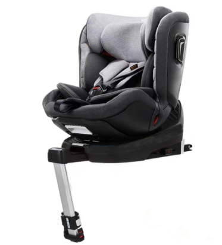

A. 采用蛋壳型座椅设计，贴合新生儿脊椎，遵循了工程心理学和生理学原则
B. 可以正反向五档调节，适用于0-12岁儿童，遵循了实用性原则
C. 拥有智能监测系统，实现可视化安全提醒，遵循了耐用性原则
D. 采用实心注塑骨架和蜂窝式高密结构，使用时安全稳固，遵循了安全性原则

   标准答案：C

   6\.某同学在生活中经常忘记物品存放位置，因此想要设计一款智能寻物装置。他围绕设计目的、使用环境、实现方式等展开设计构思，制定了多种设计方案。该同学下一步应该进行的是（　）

A. 方案的制订
B. 方案的构思
C. 方案的比较、权衡和决策
D. 方案的改进和扩展

   标准答案：C

   7\.根据如图所示立体图，其三视图中缺少的图线有（  ）

   

   A.1条              B.2条              C.3条              D.4条

   标准答案：B

   8\.通用技术实践课上，某同学设计了如图所示的零件。图中尺寸标注错误的有（　）

   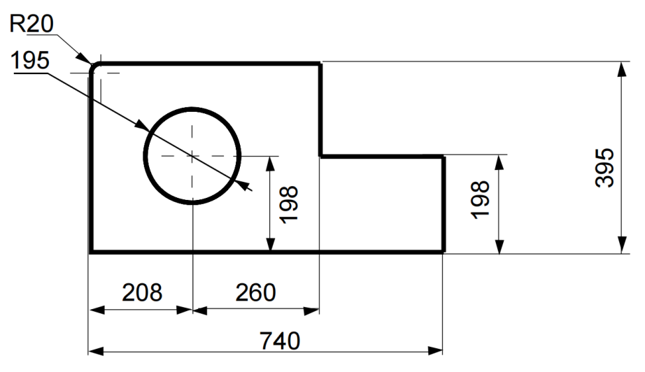

   A.1处              B.2处              C.3处              D.4处

   标准答案：B

   9\.下列实物与电子元器件图形符号不一致的是（　）

|  | 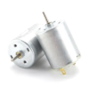 |  | 

 |
|:-----------------------------------------------------------------------------------------------------------------------------------------------------------:|:-----------------------------------------------------------------------------------------------------------------------------:|:----------------------------------------------------------------------------------------------------------------------------:|:-------------------------------------------------------------------------------------------------------------------------------------------------------------------------:|
|                                                                                                                                                             | B.                                                                                                                            | C.                                                                                                                           | D.                                                                                                                                                                        |

   标准答案：C

   10\.某同学准备用 3mm 厚的钢板加工如图所示的鱼形钥匙坠，下列描述正确的是（　） 

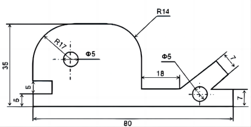

A. 加工流程为：划线→锯割→锉削→钻孔
B. 用手锯锯出“鱼头”圆弧处的大致轮廓后再锉削成型
C. 用圆锉对弧形轮廓进行锉削加工
D. 使用台钻钻孔时应该戴上手套

标准答案：B

11\.将一根长300mm、直径20mm的钢管加工成长度相等、两端光滑的三段，下列工具中不需要的是（　）

A. 锤子    B. 台虎钳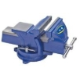
C. 钳工锉    D. 手钢锯

标准答案：A

12\.某同学为了方便载物，给自行车加装车筐，连接车筐和车架最适合使用的标准件是（　）

| `   `A.铆钉          B.螺栓和螺母          C.自攻螺丝       D.膨胀螺栓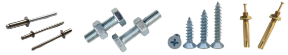 |
|:---------------------------------------------------------------------------------------------------------------------:|

标准答案：B

13\.汽车碰撞试验属于（    ）

A．优化试验

B．环境适应性试验

C．老化试验

D．破坏性试验

标准答案：D

14\.如图所示为某小组小夜灯设计过程评价雷达图，下列结论不正确的是（　）

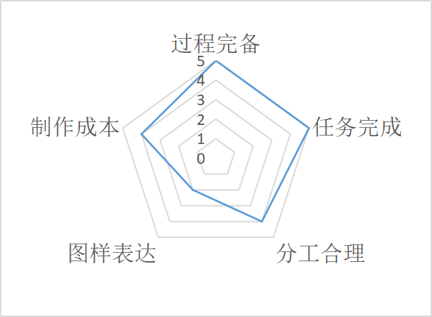

A. 分工比较合理    
B. 图样表达清晰明确    
C. 过程非常完备    
D. 任务圆满完成

` `标准答案：B

15\.关于历史名桥赵州桥，下列描述不正确的是（　）

A. 采用圆弧拱形式，实现了低桥面和大跨度的双重目的      
B. 采用多孔设计，便于排洪
C. 桥体饰纹雕刻精细,具有较高的艺术价值
D. 赵州桥是框架结构，采用榫卯连接

   标准答案：D

   16\.如图所示，从水井中取水时，绳子受到外力作用产生的变形形式是（  ）

   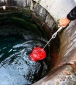

A．弯曲变形    B．拉伸变形

C．剪切变形    D．挤压变形

标准答案：B

17\.从结构强度和稳定性的角度分析，下列广告牌设计方案中最不合理的是（   ）

|

|

|
| - | - |
|A.|`  `B.|
|

|

|
|C.|`  `D.|

标准答案：D

18\.下列关于流程的说法正确的是（　）

A. 在生产活动中，为了实现不同的技术目标，需要不同的流程
B. 所有流程由固定的几个环节组成
C. 流程中各个环节的时序一定是不能改变的
D. 流程中的环节可以不连续，环节之间可以断开

标准答案：A

19\.某家具厂以木材为原料生产家具，主要包括以下环节：①备料②划线③组装④锯割⑤构件制作⑥喷漆。加工流程正确的是（　）

A.①②④⑤③⑥

B.②①⑤⑥④③

C.②④①⑤③⑥

D.①⑤⑥②④③

标准答案：A

20. 如图所示为优化后的汽车日常保养流程图，下列说法不正确的是（　）

清洁打蜡

顶起车辆

润滑工作

更换机油

放下车辆

轮胎检查

    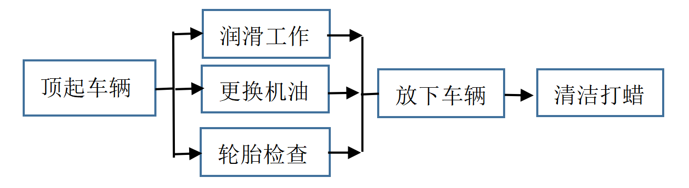

A. ` `流程优化的目的是提高生产效率、经济效益
B. ` `流程的优化建立在对流程各个内在因素充分研究和理解的基础上
C. ` `更换机油和清洁打蜡两个环节可以互换
D. ` `图中的三个并行环节有效缩短了工期

标准答案：C

21\."中国天眼"是目前世界上口径最大、最精密、最灵敏的射电望远镜，具有探索宇宙、探测空间信号、寻找脉冲星等作用，是一个复杂的系统，该系统属于（　）

A. 抽象系统、自然系统    
B. 抽象系统、人工系统
C. 实体系统、人工系统
D. 实体系统、自然系统

标准答案：C

22\.现代建筑系统的建筑能耗主要包括采暖、空调、通风、热水、炊事、照明、家用电器、电梯和建筑相关设备等方面的能耗。下列建筑节能方式不合理的是（  ）

A. 使用矿棉或矿棉制品制作建筑物内外墙的保温、隔声材料
B. 在建筑表层使用薄层绝热涂料，减少建筑物对太阳光的吸收
C. 采用保温用硅酸钙板建造外围墙壁或屋面
D. 高层建筑不用电梯

   标准答案：D

   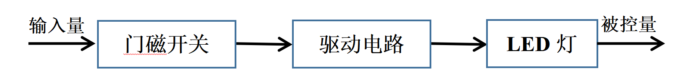

23.如图所示为某简易门磁报警器控制系统框图。当门磁开关检测到门窗关闭时，驱动电路控制LED灯熄灭，当门磁开关检测到门窗打开时，驱动电路控制LED灯点亮。下列说法不正确的是（  ）

A. 门磁开关是控制器
B. 门窗的开和关是输入量
C. LED灯是执行器
D. LED灯的亮和灭是被控量

标准答案：C

24\.关于控制中的干扰，下列说法不正确的是（  ）

A. 开环控制抗干扰能力比较强
B. 闭环控制也可能受干扰影响
C. 有些干扰可以避免或消除，有些干扰不能完全避免
D. 提高控制系统的性能可以有效减弱干扰

标准答案：A

**二、综合题（共4题，每题10分，共40分）**

（一）

25\.某同学观察到学校所使用的展示板如图1所示，由于其展示面竖直，以致展示效果不够理想，该同学想利用在通用技术课所学的知识对其进行改进。改进设计构思如图2所示，具体要求如下：

①展示板和立柱的连接为可拆卸结构；

②展示板与立柱间的仰角可在0—45°范围内调节；

③立柱与展示板之间的连接结构要求牢固，安装要简单，调节要方便。

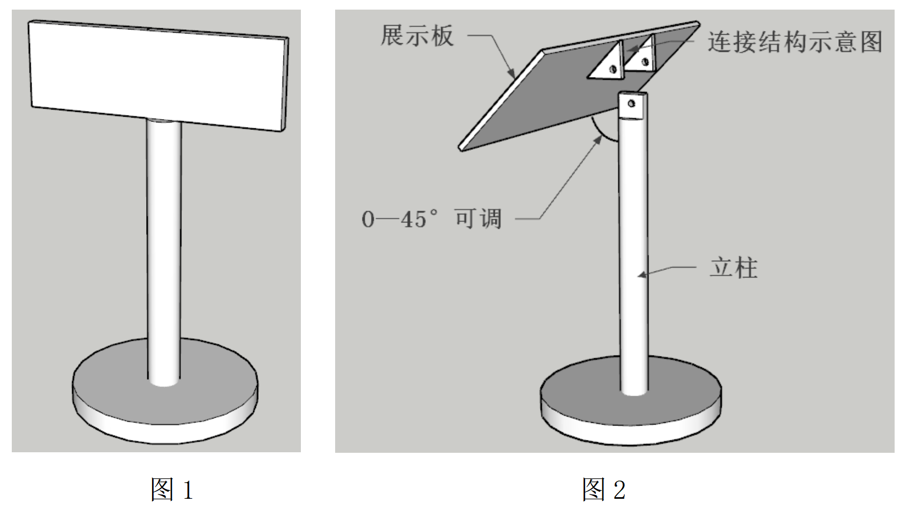

图1                             图2

请同学们根据以上材料，回答下列问题：

（1）根据广州气候特征和在室内外使用等情况，立柱选用不锈钢要比木材更好，这主要考虑的是         (使用者的喜好/产品使用环境/产品本身的美观性)；

标准答案：产品使用环境

（2）在制图过程中进行尺寸标注时，可以只标注数字不标注单位，此时尺寸单位是      ；

标准答案：mm/毫米

（3）为了检验改进后的设计是否符合设计要求，以下试验不合理的是（　）；

A.水平方向推动展示板，测试其稳定性

B.对展示板施加向下的压力，测试连接结构的牢固程度

C.将展示板装置从高处扔下，测试其强度

D.调节展示板仰角，观察能否在0—45°范围内保持稳定

标准答案：C

（4）如图2所示展示板经过一段时间使用后容易松动，该同学设计增加一根如图3所示的支撑杆，要满足设计要求且最节省材料，下列支撑杆长度最合适的是（　）；

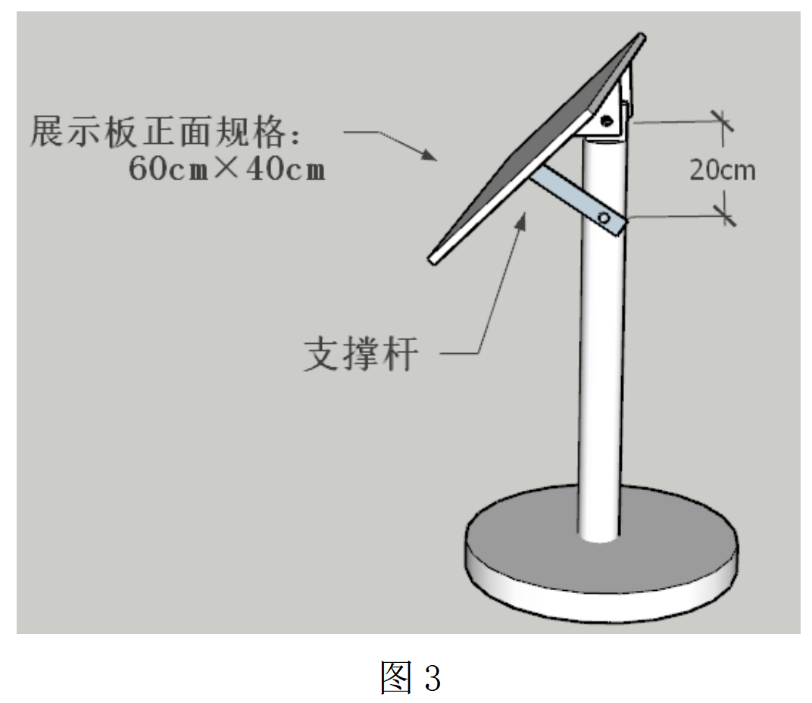

图3

A.6cm        B.12cm        C.18cm        D.30cm

标准答案：C

（5）为方便快速调节展示板仰角，需要在支撑杆上开孔或开槽，下列几个设计方案最合理的是（　）。

|  |  | 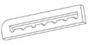 | 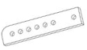 |
|:---------------------------------------------------------------------- |:---------------------------------------------------------------------- |:---------------------------------------------------------------------- |:---------------------------------------------------------------------- |
| A.                                                                     | B.                                                                     | C.                                                                     | D.                                                                     |

标准答案：C

（二）

26\.如图所示为某同学设计制作的滑轮装置示意图，该装置用膨胀螺栓固定在混凝土横梁上,请回答下列问题：

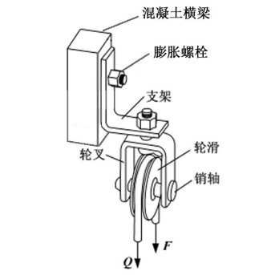

（1）滑轮在力F和Q的作用下处于平衡状态，此时支架主要受力形式是\_\_\_\_\_\_\_(受拉/受弯曲/受扭转/受剪切)；膨胀螺栓主要受力形式是\_\_\_\_\_(受拉/受弯曲/受扭转/受剪切)；

标准答案：受弯曲；受剪切

（2）滑轮和轮叉间采用的连接方式是\_\_\_\_\_(刚连接/铰连接)；

标准答案：铰连接

（3）对不锈钢支架进行钻孔时，不需要用到的工具是（　）；

   A. 凿子　B. 样冲　Ｃ.划针　Ｄ.钻头

   标准答案：Ａ

   （4）为了测试滑轮装置的强度和性能，在装置上悬挂重物并进行升降试验，这种试验方法属于（  ）。

   `　`Ａ. 对比试验　　Ｂ.模拟试验　　Ｃ. 实物试验　　Ｄ.仿真试验

   标准答案：Ｃ

   （三）

   27\.如图所示为某城市的污水处理流程图，请根据该流程图回答下列问题：

   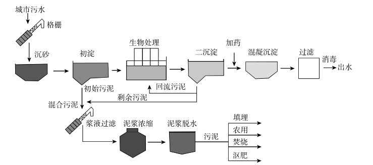

   （1）该污水处理流程属于\_\_\_\_\_\_\_\_\_\_\_\_（工作流程/工艺流程）；

   标准答案：工艺流程

   （2）浆液过滤环节的混合污泥来自初淀环节和\_\_\_\_\_\_\_\_\_\_\_\_环节；

   标准答案：二沉淀

   （3）根据该污水处理流程图，下列说法正确的是（　）；

   A．生物处理与初淀是并行工序    

   B．泥浆浓缩与泥浆脱水是串行工序    

   C．二沉淀与混凝沉淀环节可以互换

   D．生物处理和二沉淀环节可以互换

   标准答案：B

   （4）对该流程进行优化的步骤有：①流程改进的实施；②确定优化的方案；③确定优化的目标和要求；④分析流程的现状。正确的顺序是（　）；

   A．①②④③           B．④③②①      

   C．④③①②           D．②①④③

标准答案：B

   （5）关于该污水处理流程的优化，下列说法正确的是（　）。

   A. 流程优化只能通过减少环节实现

   B. 流程优化只能通过合并环节实现

   C. 取消污泥处理环节，就可以实现流程优化

   D. 为了缩短工期，可以改造或更新设备

   标准答案：D

   （四）

28. 如图所示为某款变频式冰箱的温度控制系统框图，温度检测器将检测到的温度传给数控装置，数控装置根据温度的差异，自动加大或减小变频式电动机的频率和压缩机的制冷功率，以相对节能的方式实现温度控制。
    
    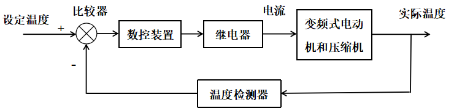
    
    此外，冰箱内一般安装了照明灯，当冰箱门被打开时，照明灯自动点亮，当冰箱门被关闭时，照明灯自动关闭。
    
    请根据以上材料，回答下列问题：
    
    （1）冰箱照明灯的控制过程是\_\_\_\_\_\_（开环/闭环）控制；

标准答案：开环

（2）从控制系统组成的角度分析，冰箱照明灯控制系统与冰箱温度控制系统的主要区别在于有无（  ）；

A．控制器    B．反馈环节

C．执行器    D．被控量

标准答案：B

（3）在冰箱温度控制系统框图中，被控对象是（  ）；

A．继电器    B．电流

C．实际温度    D．变频式电动机和压缩机

标准答案：D

（4）在冰箱温度控制系统框图中，冰箱内实际温度是（  ）；

A．控制量    B．执行器

C．被控对象    D．被控量

标准答案：D

（5）以下不属于冰箱温度控制系统中干扰因素的是（  ）。

A．多次开关冰箱门    B．调低冰箱设定的温度值

C．电压波动    D．放入热菜

标准答案：B
