# **广州市通用技术学业水平考试2023年A卷**

**一、单项选择题（共24题，每题2.5分，共60分）**

1\.柔性电池具有良好的柔韧性和可塑性，是一种在弯曲和变形的情况下仍然可正常工作的电池。它的研制运用了材料、化工、电子等多学科知识，体现了（     ）

A.技术的实践性

B.技术的综合性

C.技术的相关性

D.技术的价值性

答案：B 

2\.技术的发展对人、社会和自然环境带来影响，下列说法正确的是（     ）

A.禁止使用石油才能促进社会发展

B.推广和应用新能源技术有利于人与自然的和谐发展

C.过度使用化肥有助于社会的可持续发展

D.提高环保标准不利于社会经济发展

答案：B

3\.中国国家大剧院建设前期从全球征集了44个方案，经过三轮投票，最终确定国外某著名设计师的方案。这个过程属于（     ）

A.设计构思

B.方案的分析、比较、权衡和决策

C.确定设计课题

D.测试、评估及优化

答案：B

4\.设计师发现普通闹钟关闭方法简单，达不到闹醒效果，于是设计了如图所示的地毯闹钟，用户必须在地毯闹钟上踩住3秒以上才能关闭闹钟。在明确设计问题环节中，不需要考虑的因素是（    ）

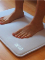

A.设计的用户需求

B.设计的社会价值

C.设计的评价方式

D.设计的技术标准

答案：C

5\.如图所示为某款可折叠的多功能无线电吹风，关于该电吹风的设计，下列说法不正确的是（    ）

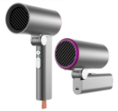

A.无线且可折叠，遵循了设计的实用性原则

B.充电采用Type-C接口，遵循了设计的标准化原则

C.过热自动断电，遵循了设计的经济性原则

D.经过测试可折叠10万次以上，遵循了设计的耐用性原则

答案：C

6\.某设计师在使用普通挤压瓶时，发现单手操作很不方便，设计了一款如图所示的新式单手挤压瓶。在方案构思环节中，他列出了普通挤压瓶的优缺点和不足，这种构思方法是（    ）

A. 黑箱法
B. 列举法
C. 移植借鉴法
D. 筛选法

   答案：B 

   7\.如图所示工件，其三视图中缺少的图线有(　　)

   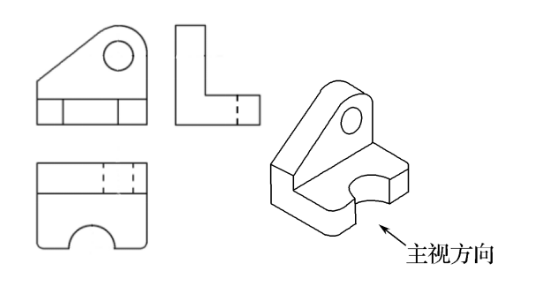

   A.1条     B.2条     C.3条    D.4条

   答案：C  

   8\.如图所示，某零件的尺寸标注不正确的有(　　)

| 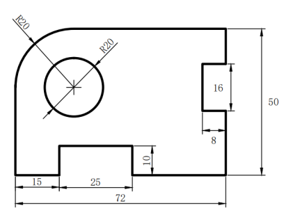 |
|:---------------------------------------------------------------------------------------------:|

A．2处      B．3处          C．4处              D．5处

答案：C  

9\.如图所示为某恒温电热水壶电路图，该电路中没有用到的电子元器件是（    ）

A.电阻      B.加热器      C.熔断器     D.三极管

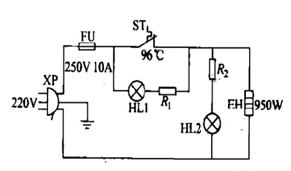

答案：D 

10. 零件加工时，要根据加工形状选用不同类型的锉刀。对如图所示金属圆孔锉削，最合适的锉刀是（    ）
    
    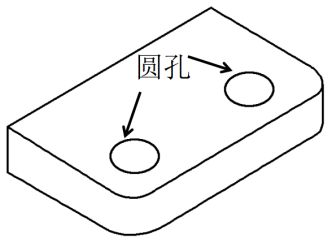  
    
    | 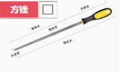 | 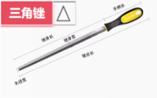 |
    |:--------------------------------------------------------------:|:--------------------------------------------------------------:|
    | A.方锉                                                           | ` `B.三角锉                                                       |
    | 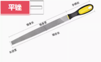 | 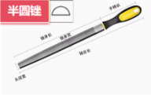 |
    | C.平锉                                                           | D.半圆锉                                                          |
    
    答案：D  
    
    11\.加工如图所示小连接片的圆孔时，下列操作不正确的是(　　)
    
    
    
    A．用样冲在待钻孔的圆心位置冲出浅凹窝
    
    B．用手扶住工件进行钻孔
    
    C．钻孔时要戴防护眼镜，以防钻屑飞出伤害眼睛
    
    D．开始钻孔时，慢慢向钻头施加压力
    
    答案：B

11. 下列零件不属于标准件的是（    ）
    
    | 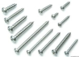 |  |  |  |
    | ---------------------------------------------------------------------- | ---------------------------------------------------------------------- | ---------------------------------------------------------------------- | ---------------------------------------------------------------------- |
    | A.螺钉                                                                   | ` `B.垫圈                                                                | C.螺母                                                                   | D.LED灯                                                                 |
    
    答案：D  

12. 在"天问一号"火星探测器研制的过程中，运用了一套虚拟现实的演示系统进行技术试验，研制人员不仅可以模拟装配过程，减少后期实际装配时的风险，还可以模拟出火星车在火星表面的工作状态，该种技术试验的方法属于（     ）
    A. 实物试验
    B. 对比试验
    C. 模拟（模型）试验
    D. 计算机仿真试验
    
    答案：D

13. 如图所示两款蓝牙耳机及其评价雷达图，下列分析中不正确的是（       ）
    
    | 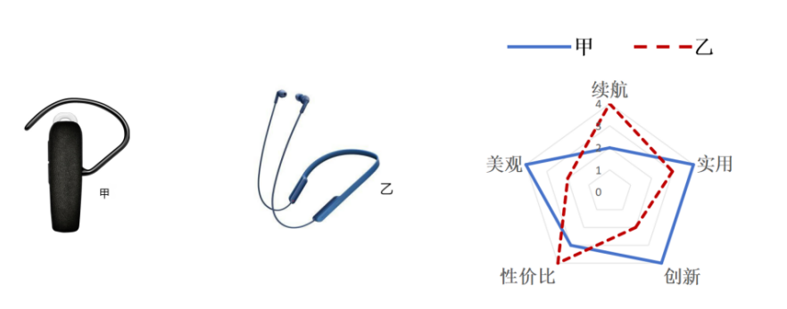 |
    | ---------------------------------------------------------------- |

A. 甲比乙美观
B. 乙的待机时间比甲长
C. 甲的实用性比乙好
D. 乙的性能一定比甲好

   答案：D

   15\.如图所示，用螺丝刀拧螺丝时，螺丝刀杆受力产生的变形形式是（    ）

   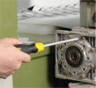

   A．弯曲变形        B．拉伸变形

   C．扭曲变形        D．剪切变形

   答案：C

   16\.如图所示落地灯，在使用时发现其折叠杆调整到某些角度时，台灯容易翻倒，下列改进措施合理的是（       ）

   

   A.增加折叠杆的长度        B.增加底座的质量   

   C.增加折叠杆的厚度        D.增加灯罩的质量

   答案：B

   17\.欹器是古代的一种倾斜易覆的盛水器，水少时倾斜，水适中时保持直立，水满时倾覆。某同学设计了几款欹器模型方案，最合理的是（        ）

| ![ref1] | ![ref2] |
|:-------:|:-------:|
| A.      | B.      |
| ![ref3] | ![ref4] |
| C.      | D.      |

   答案：B

18. 流程广泛存在于人们的生产和生活中，下列关于流程的说法不正确的是（      ）
    A. 工作流程的环节是一系列必须做的具体工作内容
    B. 工艺流程的环节与相关的生产技术、生产过程和工艺设备等紧密相关
    C. 将串行工序改为并行工序，一定可以节省人力和时间
    D. 任何流程都包含具体的环节和时序关系
    
    答案：C

19. 如图所示广州南站部分时刻表，这种流程的描述属于（    ）
    
    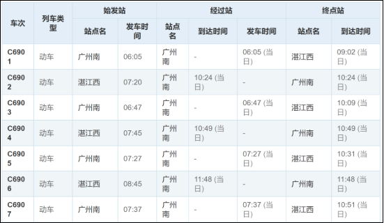

A. 文字表达
B. 表格表达
C. 图示表达
D. 方框流程图表达

   答案：B

20. 传统电影院购票流程包括排队、选座、支付等环节，观众购票约需要10分钟。流程优化后，采用在线订票系统，观众购票约需要3分钟，购票更便捷。关于该购票流程优化的目的，下列说法不正确的是（    ）
    A. 提高电影票价
    B. 提高购票效率
    C. 缩短观众购票的时间
    D. 降低电影院的人力成本
    
    答案：A

21. 下列最能体现系统相关性的成语是（   ）
    
    A.唇亡齿寒
    
    B.各自为政
    
    C.独木不成林
    
    D.同心协力
    
    答案：A
    
    22\. 下列优化措施中，不能实现建筑系统节能目标的是（    ）
    
    A.采用高能效的空调设备
    
    B.使用高效保温隔热外墙
    
    C.安装太阳能热水器
    
    D.安装视频监控系统
    
    答案：D
    
    23\. 青铜文物在我国有着悠久的历史，目前出土的青铜文物最早距今已有四五千年，是中华民族重要的文化遗产。有研究表明，温度15~25℃、相对湿度低于35%是青铜器的最佳保存条件。因此，博物馆会利用恒温恒湿控制系统来调节馆内环境的温湿度。博物馆的这种恒温恒湿控制系统属于（      ）
    
    A.开环手动控制
    
    B.开环自动控制
    
    C.闭环手动控制
    
    D.闭环自动控制
    
    答案：D
    
    24.某同学为解决暑假外出无法给植物浇水的问题，设计了一套自动浇水系统以保持土壤一定的水分，该控制系统方框图如图所示，图中①处应该是（      ）
    
    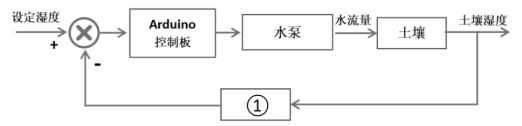
    
    A.水位传感器
    
    B.延时继电器
    
    C.湿度传感器
    
    D.红外传感器
    
    答案：C
    
    **二、综合题（共4题，每题10分，共40分）**
    
    （一）
    
    25.某美发用品公司通过调研发现，越来越多的家庭选择在家里理发，该公司计划设计一款家用理发器，如图所示，下列是该理发器的功能描述： 
    
    ①采用多档位设置，调节方便，可锁定留发长度范围为0.7—21mm；
    
    ②支持即插即用，采用通用的Type-C接口，连接充电宝、电脑、USB 插座等常用设备即可供电；
    
    ③外壳采用工程塑料一体化成型，内置大容量锂电池； 
    
    ④有电量提示灯，能显示剩余电量；
    
    ⑤刀头采用高硬度材料制作，易拆卸，可水洗；
    
    ⑥刀头和定位梳接触肌肤的部位，均做圆角处理；
    
    ⑦智能防卡发，避免夹住头发拉伤头皮。

\
    

    请根据以上材料，回答下列问题：

（1）该公司发现问题的途径是（     ）；

A.人类生存遇到必须解决的问题

B.设计者根据一定目的主动发现设计问题

C.用户指定的设计问题

答案： B

（2）制作理发器外壳所使用的加工工艺是         （切削加工/冲压成型/注塑成型)；

   答案：注塑成型

（3）最适合制作该理发器刀头的材料是        （陶瓷/铁片/铝合金)；

   答案：陶瓷

（4）为了测试理发器的切割精度，选择一些长度相近、质地相似的头发，固定在平整的表面上，使用理发器将切割片段从测试样本中剪下。对多个样本进行重复测试，以获得更准确的数据。这种技术试验属于（     ）；

   A.性能试验    B.老化试验    C.环境适应性试验    D.破坏性试验

   答案：A

   （5）公司打算对该产品申请专利，下列有关专利的说法正确的是（　 ）。

   A.专利的类型包括外观设计专利、发明专利、著作专利

   B.所有技术产品都需要申请专利

   C.允许专利所有权人对专利技术具有一定的垄断性

   D.该公司终身享有其专利独占权

   答案：C

   （二）

   26\. 如图1所示折叠晾衣架在家庭使用率非常高，但是在使用之前一定要将晾衣架按要求打开，保证结构的稳定才能安全使用。请按要求回答下列问题：

| 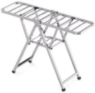 | 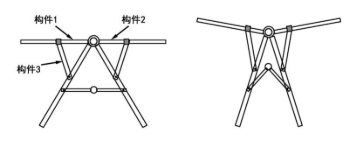 |
| ---------------------------------------------------------------------------------------------- | ---------------------------------------------------------------------------------------------- |
| **图1**                                                                                         | **图2                      图3**                                                                 |

1. 晾衣架的结构类型属于          （框架结构/壳形结构/实体结构）；
   
   答案：框架结构

2. 该晾衣架的主视图如图2所示，构件1与构件2的连接方式是       （铰接/焊接/胶接）；
   
   答案：铰接

3. 如图2所示，构件3起到支撑作用，其产生的变形形式是       （拉伸变形/挤压变形/弯曲变形）；
   
   答案：挤压变形

4. 某同学发现长衣物晾晒时容易触碰地面，所以将晾衣架收拢为如图3所示的形态，这样做会影响晾衣架结构的      （强度/稳定性）；
   
   答案：稳定性

5. 某同学想提高此晾衣架的稳定性，拟增加两条可拆卸的不锈钢管a、b，构思设计了如图4所示的方案1和方案2，能提高晾衣架稳定性的设计是      （方案1/方案2）。
   
   ` `答案：方案2
   
   | 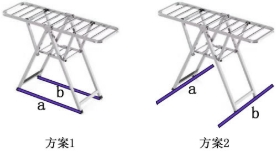 |
   |:----------------------------------------------------------------------------------------------:|
   | **图4**                                                                                         |
   
   （三）
   
   27\. 如图所示为一种柑橘果汁饮品生产流程，请根据该流程回答下列问题：
   
   
   
   （１）调配环节是将果汁、果酒和\_\_\_\_\_\_\_\_\_（桔络／果醋）按一定的比例进行混合调配成饮品；
   
   答案：果醋
   
   （２）柑橘榨汁和柑皮加工是\_\_\_\_\_\_\_(串行工序／并行工序）；
   
   答案：串行工序
   
   （３）关于该流程说法正确的是（   ）；
   
   A．喷雾剂的上一环节是柑橘榨汁
   
   B．果酒和果醋两个环节的顺序可以调换
   
   C．为了节约成本，柑橘清洗这个环节可以省去    
   
   D．该流程属于工艺流程
   
   答案：Ｄ
   
   （４）若要对该流程进行优化，需要做的步骤有：①确定优化目标和要求；②分析流程的现状；③确定优化的方案；④流程改进的实施。正确的顺序是（  ）；
   
   Ａ.③②①④    B.②①③④　　Ｃ.①②③④    D.②③①④
   
   答案：B
   
   （5）为了保证产品质量，对该流程进行优化，下列说法不正确的是（    ）。
   
   A.在调配环节后面应增加一个检测分析环节，对调配后的饮品进行检测
   
   B.若饮品检测不合格，需要重新进行返工，当无法返工时，应当报废
   
   C.当调配的饮品出现风味问题，如果调整比例能达到标准，则无需报废
   
   D.对调配后的饮品增加检测分析环节，属于工期优化
   
   答案：D
   
   （四）
   
   | 
![IMG_256]

 |     |
   | --------------------------------------------- | --- |
   | 图1                                            | 图2  |

6. ![IMG_256]某款太阳能跟踪控制系统如图1所示，它的结构示意图如图2所示，该装置通过跟踪太阳，使太阳能电池板充分吸收太阳辐射的能量。其工作原理是：当传感器检测到太阳光线与太阳能电池板夹角不为90°时，控制器控制电机转动，以调整太阳能电池板方向，直到太阳光线与太阳能电池板的实际夹角为90°。图3为该控制系统方框图。
   
   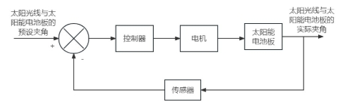
   
   `                               `图3
   
   请根据以上材料，回答下列问题：
   
   （1）该控制系统属于      （手动/自动）控制，       （开环/闭环控制）；答案：自动，闭环
   
   （2）该控制系统中，电机是（    ）；
   
   A．被控量       B．执行器
   
   C．控制器       D．被控对象
   
   答案：B
   
   （3）该控制系统中，太阳光线与太阳能电池板的实际夹角是（    ）；
   
   A．被控量     B．被控对象
   
   C．控制器     D．控制量
   
   答案：A
   
   （4）下列因素不会影响该控制系统正常工作的是（     ）。
   
   A．台风                 B．其它强光照射   
   
   C．阳光被遮挡           D．太阳能板产生的电流大小
   
   答案：D

[ref1]: Aspose.Words.fbf693b7-f450-4511-b25e-f91e719816e0.021.png
[ref2]: Aspose.Words.fbf693b7-f450-4511-b25e-f91e719816e0.022.png
[ref3]: Aspose.Words.fbf693b7-f450-4511-b25e-f91e719816e0.023.png
[ref4]: Aspose.Words.fbf693b7-f450-4511-b25e-f91e719816e0.024.png
[IMG_256]: Aspose.Words.fbf693b7-f450-4511-b25e-f91e719816e0.032.png
[IMG_256]: Aspose.Words.fbf693b7-f450-4511-b25e-f91e719816e0.033.png
