# **广州市通用技术学业水平考试2023年B卷**

**一、单项选择题（共24题，每题2.5分，共60分）**

1\.如图所示为某款“盲人手表”，使用动态盲文显示时间，具有语音报时功能。从技术性质的角度分析，下列说法正确的是（     ）

A.既能触摸感知时间，又能语音报时，体现技术的综合性

B.盲人和普通人都可以佩戴该产品，体现技术的实践性

C.该产品交互性好，价格贵，体现技术应用的两面性

D.首次将动态盲文与手表结合，体现技术的创新性

答案：D

2\.塑料制品的应用给人们生活带来便利，但生产过程中所产生的废料、污水、废气会对环境造成污染和破坏。关于技术与自然的关系，下列说法正确的是（    ）

A.在设计和生产新产品时，不能忽视对自然环境造成的负面影响

B.技术的发展是为人服务的，自然环境污染是次要问题，可以不予考虑

C.技术的发展会破坏自然环境，都可以通过技术彻底解决

D.技术的发展必然会给自然环境带来负面影响

答案：A

3\.“样式雷”是清代一个著名建筑世家，在建筑设计和工程管理上成就卓越。“样式雷”在建筑设计过程中要制作如图所示的“烫样”，制作“烫样”的环节属于（    ）

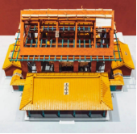

A.设计构思

B.方案的分析、比较、权衡和决策

C.制作模型或原型

D.测试、评估及优化

答案：C

4\.某设计师拟设计一款鼠标和座钟组合的新产品，设计效果如图所示。在明确设计问题环节中，设计师不需要考虑的因素是（    ）

A.制造成本

B.技术标准

C.用户需求

D.方案优化

答案：D

5\.如图所示为一款儿童滑行溜溜车，关于该产品的设计，下列说法不正确的是（    ）

A.具有骑行车、跷跷板和滑行车的多种功能，适合不同年龄阶段的儿童使用，遵循了设计的实用性原则

B.采用柔和色彩搭配的设计，满足儿童需求，遵循了设计的工程心理学和生理学原则

C.采用流线型圆滑无尖角设计，遵循了设计的安全性原则

D.采用触感舒适度极佳的亲肤材料，遵循了设计的可靠性和耐用性原则

答案：D

6\.19世纪末某设计师发明了橡胶轮胎，他将浇花用的橡胶管灌满水后，包在自行车的木制车轮边缘。这种包裹橡胶水管的车轮既能减震，又能保护车体。该设计师采用的构思方法是（     ）

A. 黑箱法
B. 列举法
C. 移植借鉴法
D. 筛选法

   答案：C 

   7\.如图所示的物体模型，其三视图正确的是(　　)

   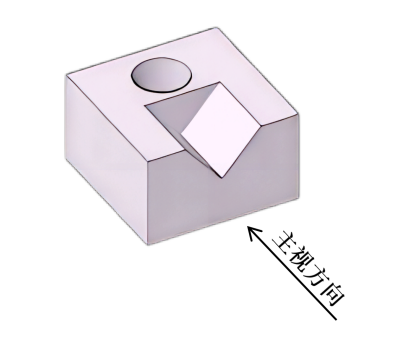

| ![ref1] | ![ref2] |
|:-------:| ------- |
| A       | B       |
| ![ref3] | ![ref4] |
| C       | D       |

   答案：C 

   8\.如图所示，尺寸标注错误的有（    ）

   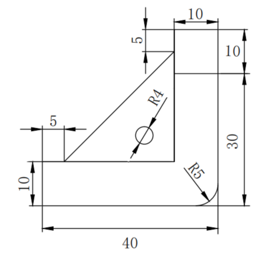

   A．1处       B．2处       C．3处             D．4处

   答案：C 

   9\.如图所示为某电吹风筒的电路图，该电路中没有用到的电子元器件是（     ）

   A.三极管      B.电热丝      C.熔断器      D.电机

   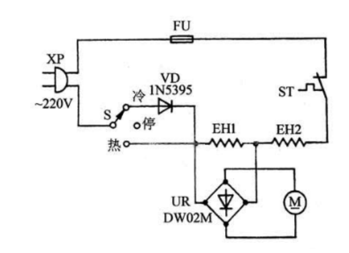

   答案：A 

   10\.制作如图所示的金属零件，钻孔加工时不需要使用的工具是（     ）

   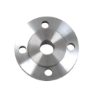

| 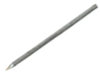 | 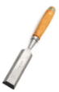 |  | 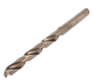 |
| -------------------------------------------------------------- |:--------------------------------------------------------------:| -------------------------------------------------------------- | -------------------------------------------------------------- |
| A.划针                                                           | B.凿子                                                           | C.样冲                                                           | D.钻头                                                           |

   答案：B

   11\.下列关于锉刀的使用方法说法不正确的是(　　)

   A．锉削时，左手的施压由大到小，右手的施压要从小到大    

   B．锉削时，锉屑嵌入齿缝内必须及时清理，不能用嘴吹锉屑

   C．锉刀使用完毕时必须清刷干净，可以使用清水冲洗

   D．锉削时，注意握锉刀姿势，要端正锉刀，使锉刀水平运动，直线前进

   答案： C 

   12\.制作可升降移动式书桌需要用到下列零件，其中不属于标准件的是（    ）

| 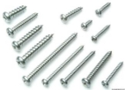 |  | 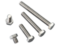 | 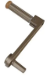 |
| ---------------------------------------------------------------------- | ---------------------------------------------------------------------- | -------------------------------------------------------------- |:--------------------------------------------------------------:|
| A.螺钉                                                                   | B.螺母                                                                   | C.螺栓                                                           | D.升降摇柄                                                         |

   答案：D  

13. CR450新一代动车组在研制中，开展了新技术部件在更高运行速度条件下的性能试验，试验列车实现单列最高时速453公里，双向两列相对交会最高时速891公里。该技术试验的方法属于（      ）
    A. 实物试验
    B. 对比试验
    C. 模拟（模型）试验
    D. 计算机仿真试验
    
    答案：A

14. 如图所示某款手持充电式紫外线杀菌器，携带方便，灭菌效果较好，价格低，但续航时间一般。与该评价相符合的雷达图是（      ）
    
    
    
    | 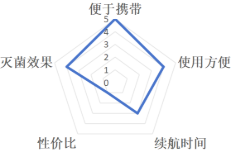 |  |
    |:--------------------------------------------------------------:|:--------------------------------------------------------------:|
    | A.                                                             | B.                                                             |
    | 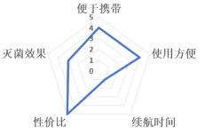 | 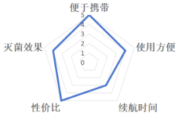 |
    | C.                                                             | D.                                                             |
    
    答案：D
    
    15\.如图所示，运动员用双手握住单杠时，单杠横杆受力产生的变形形式是（      ）
    
    
    
    A．弯曲变形      B．拉伸变形    C．扭曲变形        D．剪切变形
    
    答案：A
    
    16\.如图所示某款木质衣帽架，下列措施不能提高其强度的是（       ）
    
    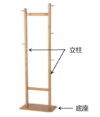

A. 增大底座的支撑面积
B. 增大立柱的横截面积
C. 在榫接处涂木工胶水
D. 将立柱换成不锈钢材料

   答案：A

   17\.某同学设计了一款立式广告牌，从结构稳定性的角度分析，下列广告牌设计方案最合理的是（    ）

| 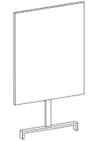 | 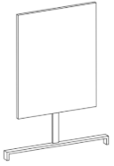 | 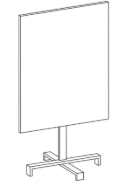 | 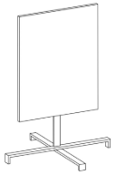 |
| ----------------------------------------------------------------------- | ----------------------------------------------------------------------- | ----------------------------------------------------------------------- | ----------------------------------------------------------------------- |
| A.                                                                      | B.                                                                      | C.                                                                      | D.                                                                      |

   答案：D

18. 流程广泛存在于人们的生产和生活中，下列有关流程的说法正确的是（       ）
    A. 流程中各个环节的时序是不能颠倒的
    B. 环节可以是一个具体的工作和活动内容
    C. 将串行工序改为并行工序，一定可以节省人力和时间
    D. 完成某个目标的生活或生产流程是唯一的
    
    答案：B

19. 如图所示为一种糖果加工的工艺流程，这种流程的描述属于（     ）
    
    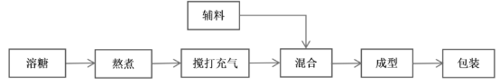

A. 文字表述
B. 表格表述
C. 图示表述
D. 方框流程图表述

   答案：D

   20\. 传统高速公路收费的流程包括发卡、放入、收费、放行等环节，一般车辆缴费通过收费站需要约2分钟；而采用ETC缴费系统，车辆缴费通过收费站需要约20秒。关于该流程的优化，下列说法不正确的是（    ）

   A.提高了车辆收费标准

   B.减少了人力成本支出

   C.减少了车辆通过收费站的时间

   D.缓解了高速出入口的拥堵状况

   答案：A

21. 下列最能体现系统整体性的成语是（    ）
    
    A.惊弓之鸟
    
    B.独木不成林
    
    C.井底之蛙
    
    D.一箭双雕
    
    答案：B

22. 关于现代桥梁系统的节能措施，下列说法不正确的是（    ）
    A. 在桥梁建设过程中，选择高性能和更耐用的材料 
    B. 采用太阳能、风能等可再生能源技术用于桥梁照明系统
    C. 优化桥梁设计和施工工艺
    D. 无需经过质量检测，对老旧桥梁全部拆除重建
    
    答案：D
    
    23\.大型超市的公共厕所通常采用红外感应冲水系统，这种冲水系统属于（      ）
    
    A.开环手动控制
    
    B.开环自动控制
    
    C.闭环手动控制
    
    D.闭环自动控制
    
    答案：B
    
    24\. 如图所示是公共场所和居民区公共楼道普遍使用的声光控灯照明系统控制方框图，图中“执行器”对应的元器件是（     ）
    
    
    
    A.电磁继电器
    
    B.拾音器
    
    C.光敏电阻
    
    D.二极管
    
    答案：A
    
    **二、综合题（共4题，每题10分，共40分）**
    
    （一）
    
    25\.校运动会开幕式，某同学使用如图1所示的引导牌，发现引导牌不便于携带。计划改进设计,设计要求如下：
    
    ①可以方便地展开和收拢；
    
    ②引导牌展开后形状和尺寸与原来的相当，展开后能保持结构稳定；
    
    ③引导牌收拢后的尺寸要尽可能小，便于携带；
    
    ④更新面板上的班级信息贴纸即可重复使用；
    
    他改进后的设计如图2所示。

| ![3324009aa56d4fcc8e73223990b3749] | ![3324009aa56d4fcc8e73223990b3749] |
|:----------------------------------:|:----------------------------------:|
| 图1                                 | 图2                                 |

请根据以上材料，回答下列问题：

（1）该同学发现问题的途径是（    ）；

   A.用户指定的设计问题

   B.人类生存必须要解决的问题

   C.设计者根据一定的目的主动发现的设计问题

   答案：C

（2）制作伸缩杆时需使用钢锯锯割不锈钢管材，下列操作不正确的是（   ）；

A. 安装锯条时，锯齿斜向前方
B. 起锯时用左手大拇指贴住锯条，锯条与工件表面角度要小
C. 起锯时压力要小，往返行程要短，速度要慢
D. 正常锯割时，推锯时不加压，回拉加压

   答案：D

（3）制作图2引导牌面板，最适合的材料是（　　）；

A. 玻璃
B. 铝合金
C. 厚钢板

   答案：B

（4）下列对引导牌的技术试验不合理的是（　 ）；

   A.展开引导牌，反复晃动引导牌，测试其强度

   B.竖起引导牌，对引导牌施加适当向下的压力，测试连接结构的牢固程度

   C.将引导牌装置从高处扔下，测试其强度

   D.多次收拢和展开引导牌，测试操控灵活性

   答案：C

   （5）该同学设计的引导牌参加比赛并获奖，某工厂根据他的设计方案，生产了引导牌，投放市场获得了经济效益。该同学认为工厂侵犯了他的合法权益，向法院提起了诉讼，法院不予受理。这是因为（    ）。

   A.该同学参加比赛公开了作品的内容

   B.没有申请专利

   C.作品太简单不予受理

   答案：B

   （二）

26. 近年来，我国空天领域技术不断突破，航空航天发展成就斐然，大大提升了国民的民族自豪感。

（1）长征火箭如图1所示，它的制造关键技术实现了跨越式发展，哈尔滨工业大学攻克

国际性难题：用一张薄板造出3米级火箭燃料贮箱的箱底（核心关键构件）。如图2所示，火箭燃料贮箱是火箭的主体结构，占火箭结构干重的80%。火箭燃料贮箱结构类型属

于      （框架结构/壳体结构/实体结构）;

答案：壳体结构

| 

 | 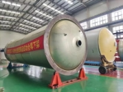 |
|:-------------------------------------------------------------------------------------------------------- |:---------------------------------------------------------------------------------------------- |

图1                              图2

（2）如图3所示，C919大飞机是我国按照国际民航规章自行研制、具有自主知识产权的大型喷气式民用飞机。该飞机采用较大比例复合材料来减少飞机的结构重量，同时优化连接技术，使机翼更坚韧更安全。如图4所示，C919采用更轻更薄的复合材料作为蒙皮，如图5所示，蒙皮之间的连接方式采用的是          （铆接/钉接/榫接），C919配备的涡扇发动机工作时温度可达约1600℃，发动机内部各构件之间的连接方式不宜采用                           

   （胶接/螺栓连接/铆接）；

   答案：铆接，胶接

|  | 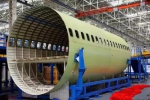 |
| --------------------------------------------------------------------------------------------- |:----------------------------------------------------------------------------------------------:|
| 图3                                                                                            | 图4                                                                                             |
| 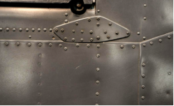 |   |
| 图5                                                                                            | 图6                                                                                             |

   （3）如图3所示，C919采用前三点式的起落架配置，前轮布置在机头的下方，两个主轮保持一定间距左右对称地布置在飞机重心稍       （前/后）处。如图6所示，飞机的起落架都由固定的支架和机轮组成，该装置在设计过程中,为提高结构稳定性，需要考虑的因素包括几何形状、重心位置、       （接触面积/支撑面积）。

   答案：后，支撑面积

   （三）

   27\.如图所示为一种甘蔗渣生产糠醛的流程。请根据该流程回答下列问题：

   

   （１）该流程以甘蔗渣为原料经烘干、拌酸后，再送入蒸球水解后形成醛汽原液，然后将所得醛汽原液送入蒸馏塔，经冷凝冷却后进入\_\_\_\_\_\_\_\_（分醛罐／废水沉淀池）；

   答案：分醛罐

   （２）脱轻塔和精馏塔是\_\_\_\_\_\_\_(串行工序／并行工序）；

   答案：并行工序

   （３）关于该流程说法不正确的是（   ）；

   A．经过脱轻塔环节后得到甲醇

   B．水洗塔与精馏塔两个环节可以互换

   C．该流程得到的产物不止一种

   D．该流程属于工艺流程

   答案：Ｂ

   （４）若要对该流程进行优化，需要做的步骤有：①确定优化目标和要求；②分析流程的现状；③确定优化的方案；④流程改进的实施。正确的顺序是（  ）；

   Ａ.③②①④    B.②①③④　　Ｃ.①②③④    D.②③①④

   答案：B

   （５）关于该流程的优化，下列说法不正确的是（   ）。

   A．流程优化需要考虑事物的内在规律和机理

   B．流程优化有助于提高经济效益和产品质量

   C．为了缩短工期，可以改造或更新设备

   D．可以通过取消冷凝冷却环节实现流程优化

   答案：D

   （四）

   28\.如图1所示，遥控门技术在汽车领域应用广泛。汽车遥控门控制系统的原理是通过控制模块BCM来控制车门，控制模块BCM接收到遥控器发出的信号后，控制电动机转动，实现车门自动打开或关闭。

|  |  |
|:--------------------------------------------------------------------------------------------- |:--------------------------------------------------------------------------------------------- |
|                                                                                               | 图1                                                                                            |

`  `汽车遥控门控制系统的方框图如图2所示。                        

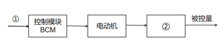

图2

请根据以上材料，回答下列问题：

（1）图2中①处是                    （开门或关门信号/电动机开启/车门开启或关闭 ）②处是                   （遥控器/车轮/车门）；

答案：开门或关门信号，车门

（2）由图2可知，该控制系统是         （手动/自动）控制系统，\_\_\_\_\_\_\_\_（开环/闭环）控制系统；

   答案：自动，开环

（3）不会影响该控制系统正常工作的因素是          （车主手机接通电话/遥控钥匙电池电量不足/控制模块BCM发生故障）。

   答案：车主手机接通电话

[ref1]: Aspose.Words.ae76b6bb-4b63-474d-9a61-5eb67b6692b8.006.png
[ref2]: Aspose.Words.ae76b6bb-4b63-474d-9a61-5eb67b6692b8.007.png
[ref3]: Aspose.Words.ae76b6bb-4b63-474d-9a61-5eb67b6692b8.008.png
[ref4]: Aspose.Words.ae76b6bb-4b63-474d-9a61-5eb67b6692b8.009.png
[3324009aa56d4fcc8e73223990b3749]: Aspose.Words.ae76b6bb-4b63-474d-9a61-5eb67b6692b8.034.png
[3324009aa56d4fcc8e73223990b3749]: Aspose.Words.ae76b6bb-4b63-474d-9a61-5eb67b6692b8.035.png
