# **广州市通用技术学业水平考试2024年A卷**

**一、单项选择题（共24题，每题2.5分，共60分）**

1\.2023年发射的天舟六号货运飞船采用改进型货物舱，相比天舟五号装载空间增加约24%，装载重量提高约22%，达到7.4吨，是当时世界上运货能力最强的货运飞船。下列说法不正确的是（   ）

A.为满足空间站物资补给量增大的实际需求，天舟六号采用改进型货物舱设计，体现技术的创新性

B.通过对货物舱和推进舱进行优化设计，天舟六号的货物装载空间得到提升，体现技术的目的性

C.天舟六号的设计和制造涉及材料、电子、自动化控制等多学科知识，体现技术的综合性

D.相比天舟五号，天舟六号运载能力更强，设计更复杂，体现技术的应用两面性

答案：D

2\. 2024年6月25日，嫦娥六号携带从月球背面采集的土壤成功返回地球，这标志着中国航天技术取得巨大进步。下列说法体现技术与自然关系的是（    ）

A．嫦娥六号研发带动相关产业链发展，促进相关技术进步

B．通过分析月球背面土壤样本，科学家可以了解月球的演化历史

C．嫦娥六号任务的成功促进了国际合作与交流，推动了全球科学界的发展

D．嫦娥六号任务的成功展示了中国在航天领域的实力，增强了民族自豪感和国家凝聚力

答案：B

3\. 某同学发现水杯经常被碰倒，决定制作一个可夹持在课桌边的杯托。下列关于制订杯托设计方案的过程，说法不正确的是(    )

   A.在制订设计方案之前要进一步明确设计要求

   B.在方案构思之后应进行设计分析

   C.可以通过绘制草图来呈现构思的方案

   D.在设计过程中可能需要反复修改设计方案

   答案：B

   4\. 某品牌手机采用先进的三折叠屏技术，在设计这款手机的过程中，设计师需要考虑多种限制因素以确保其功能和实用性。以下不属于设计限制因素的是（    ）

   A. 折叠屏的耐用性和寿命

   B. 电池容量和续航能力

   C. 手机的重量

   D. 手机的颜色

   答案：D

   5\. 深中通道是连接深圳市、中山市和广州市的跨海通道，是一项世界级的跨海集群工程。在设计中，它采用“桥、岛、隧、水下互通”组合模式，这一创新设计既充分考虑了海洋环境的复杂性，确保了工程的稳定性和安全性，又极大地提高了交通的便利性和效率。在建设过程中，选用了先进且环保的建筑材料，在保证工程质量的前提下不但降低了建设成本，减少了对周边生态环境的影响。深中通道的整体造型兼具实用性与美观性，成为一道亮丽的风景线。以上描述没有体现设计的（    ）

   A. 创新性原则

   B. 时效性原则

   C. 实用性原则

   D. 可持续发展原则

   答案：B

6. 设计师不了解心率监测模块的具体工作原理和结构，依然能设计出带心率监测功能的智能手环。该设计师采用的构思方法是（   ）
   
   A.列举法
   
   B.黑箱法
   
   C.移植借鉴法
   
   D.筛选法
   
   答案：B

7. 图1所示刨子是一种木工工具，包括刨身、刨刀片和楔木等部件，用于平整木材表面。图2是某学生用3D建模设计的刨身模型立体图，根据图3判断，正确的俯视图是（    ）

   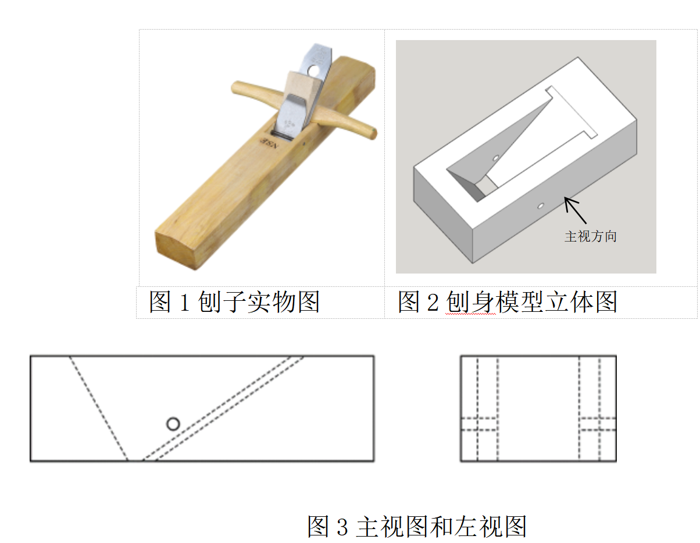
   
   图1 刨子实物图

   

   图2 刨身模型立体图

   

   

   图3 主视图和左视图

| A. | 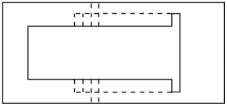 |
| --- | ----------------------------------------------------------------------------------------------------------------- |
| B. | 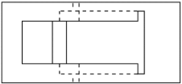 |
| C. | 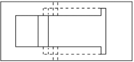 |
| D. | 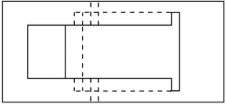 |

   答案：C 

8. 法兰是一种用于连接管道、设备或附件的盘状零件，通常由金属制成，并带有螺栓孔。下图是某款特制法兰的部分加工图，图中尺寸标注正确的是（    ）
   
   
   
   A.29
   
   B.R47
   
   C.4×Φ5
   
   D.Φ12
   
   答案：C

9. 如图所示功率放大电路图，以下说法不正确的是（     ）
   
   
   
   A.""表示的是变压器线圈
   
   B.""表示的是可调电容
   
   C.""表示的是电阻
   
   D.""表示的是三极管
   
   答案：B

10. 将一块铝合金板加工成如图所示的手机支架，不需要用到的工具是（     ）
    
    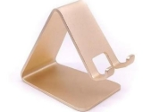
    
    | 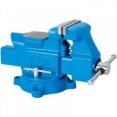 | 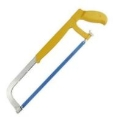 | 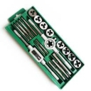 |  |
    | ----------------------------------------------------------------------------------------------- | ----------------------------------------------------------------------------------------------- | ----------------------------------------------------------------------------------------------- | ---------------------------------------------------------------------------------------------- |
    | A. 台虎钳                                                                                          | B. 锯子                                                                                           | C. 丝锥板牙套件                                                                                       | D. 锉刀                                                                                          |
    
    答案：C
    
    11\. 用木板制作可折叠板凳，需进行画线、锯割、锉削、打磨、钻孔、装配等操作。下列操作正确的是（    ）
    
    A.画线需要用到划针、铅笔、刻度尺、墨斗等工具
    
    B.锯割时需考虑锯缝损耗，故画线时应预留加工余量
    
    C.操作电动手钻时，必须戴上棉手套保护双手
    
    D.在推锉过程中，左手的施压要由小变大，右手的施压由大变小
    
    答案：B
    
    12\. 为提升如图所示木制书柜层板的承载能力，拟使用角码对层板进行加固，下列角码安装位置和款式最合理的是（     ）
    
    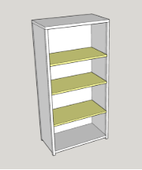
    
    A.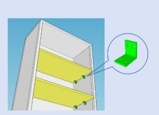
    
    B.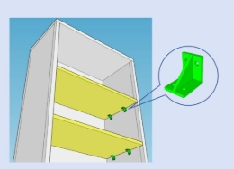
    
    C.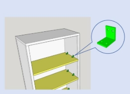
    
    D.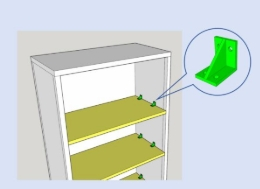
    
    答案：B
    
    13\.手机电池须经历一系列检测，以保证其性能和安全性。下列关于手机电池检测的说法不正确的是（    ）
    
    A.对电池进行2500次的充放电，检测电池的电量和电压等参数，属于寿命测试
    
    B.对充满电的单体电芯用钢针进行针刺试验，属于破坏性试验
    
    C.将电池芯或电池组在-40℃进行多次充放电转换，属于强化试验
    
    D.对完全放电的电池以2.5倍推荐电流充电，观察是否起火、爆炸，属于老化试验
    
    答案：D
    
    14\.小张设计了一款AI眼镜，获得实用新型专利。下列行为属于侵犯小张专利权的是（    ）
    
    A.专利保护期限届满后，某公司生产和销售该专利产品 
    
    B.小刘购买了该产品并拍摄其外观照片在网络上发布
    
    C.在专利保护期限内，某公司未经许可生产并销售小张的专利产品
    
    D.小王撰写了关于这款AI眼镜的技术分析文章并在科技期刊上发表
    
    答案：C
    
    15\.如图所示的秋千，支架采用钢材料，下列说法不正确的是（    ）
    
    A.整体结构是框架结构
    
    B.横梁和支撑架连接采用焊接，结点属于铰结点
    
    C.荡秋千时横梁承受弯曲变形的力
    
    D.支撑架采用三角形结构是为了确保结构的稳定性
    
    答案：B
    
    
    
    16\.斗拱是中国建筑特有的一种结构，位于立柱和横梁交接处，由方形的斗、升、拱、翘、昂等部分组成，其功能是承上启下，传递荷载，同时增加屋檐的出挑。下列关于斗拱描述正确的是（   ）
    
    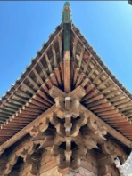

A.多层斗拱的主要作用是增加建筑物的高度

B.通过分散荷载到多个支撑点，使建筑物更稳固

C.斗拱制作时卯口朝上，在受力发生弯曲后缺口变大，容易“散架”，结构不稳固

D.主要用于现代高层建筑中，以提高建筑物的抗震性能

答案：B

17\.如图所示天坛祈年殿拼接积木，按照1：200的微缩比例制作，所有零部件采用ABS或PC材料，光滑无毛刺，兼具韧性和强度。877个零件和75种榫卯部件以全榫卯的方式拼接而成。柱子按照12时辰、24节气的设计进行了复原。下列分析与评价不恰当的是（　　）

A.采用ABS、PC无毒材料，光滑无毛刺，实现了人机关系的健康和安全目标

B.精确的比例和结构设计，使模型具备祈年殿建筑展示功能

C.微缩模型的承载能力与实际建筑无显著差异

D.祈年殿的柱子按照12时辰、24节气进行设计，体现了技术与文化的有机结合

答案：C

18\.随着城市的发展，污水处理日趋重要，某城市污水处理的工艺流程如图所示，下列关于该流程说法正确的是（   ）

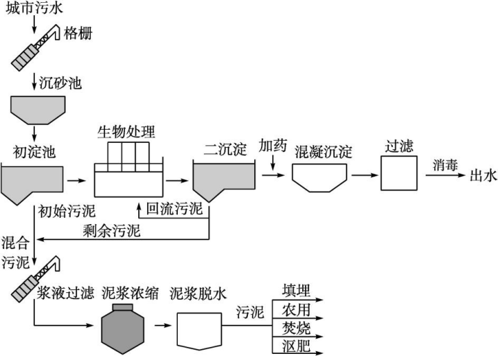

A.该流程中环节都用图形和文字表示，时序都用箭头表示

B.生物处理环节不能再细分

C.从流程中不能看出泥浆脱水后的去处

D.该工艺的最终产物只有污泥

答案：A

19\.某装修公司翻新改造住宅厨房的工作流程如图所示，下列说法不正确的是（   ）

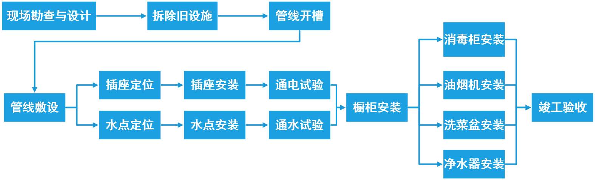

A.拆除旧设施和管线开槽环节的时序不能颠倒

B.插座定位和水点定位是并行工序

C.管线开槽和管线敷设是串行工序

D.消毒柜安装完成后才能安装洗菜盆

答案：D

20\.某公司研发了一种具有高温特性的半导体芯片，其加工流程如图所示。为了提高产品质量,加快生产速度，需要对该流程进行优化，下列说法不正确的是（   ）

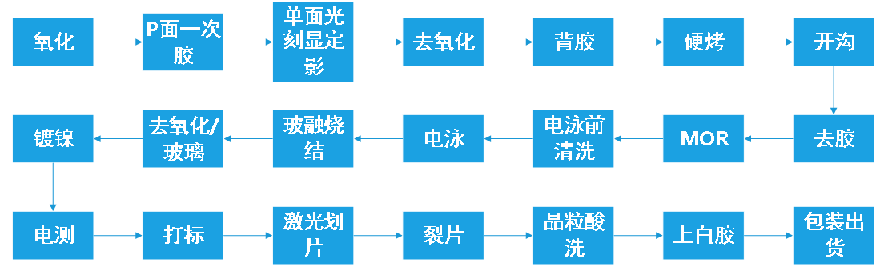A.在包装出货之前，增加质检环节，保障产品的质量

B.为了加快制作工期，可以取消电泳前清洗环节

C.引入新技术，将晶粒酸洗和上白胶环节优化成晶粒清洗环节，属于工艺优化

D.引入新设备后，将硬烤和开沟工序由串行改为并行，缩短了生产周期

答案：B

21\.某小区的电梯监管系统包含智能预警子系统和楼控子系统。智能预警子系统具有检测电瓶车违规进入的功能，智能摄像机判断电梯内是否有电瓶车，如果检测到电瓶车则启动声光报警装置，楼控子系统控制电梯门无法正常关闭。管理员通过远程提醒用户，直到用户移除电瓶车，手动解除报警，电梯恢复正常运行，保障系统的安全和可靠。从系统分析的角度来看，下列说法不正确的是（   ）

A.智能预警系统和远程监控系统都是电梯监测系统的子系统

B.智能预警系统能准确判断车辆是否是电瓶车，体现系统的功能性

C.智能预警系统出现故障，电梯监管系统无法正常工作，体现系统的整体性

D.楼控系统管理员通过远程喊话提醒用户，并手动解除报警，体现了环境适应性

答案：D

22\. 如图所示智慧大棚控制系统，该控制系统根据采集的土壤和水分数据，控制设备使土壤保持适量的湿度和肥力，实现精准控水控肥的目的。为了提高智慧大棚系统的性能，现对该系统进行优化，下列不属于影响该系统优化因素的是（   ）

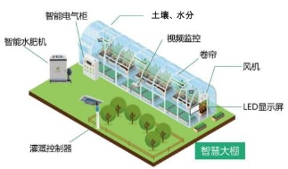

A. 土壤、水分传感器采集数据的精度

B. 智慧大棚中种植的农作物的生长特性

C. 灌溉控制器的控制精度

D. 控制系统中数据的传输速度

   答案：B

   23\. 如图所示人脸识别门禁控制系统，该控制系统由电源控制器、人脸识别门禁主机、电插锁和门夹等组成。用户面对人脸识别门禁主机（简称主机）时，主机摄像头捕捉用户面部图像数据，与数据库中存储的人脸数据进行比对验证，如果数据匹配成功将门打开，如果数据匹配失败则门无法打开。该控制系统是（    ）

   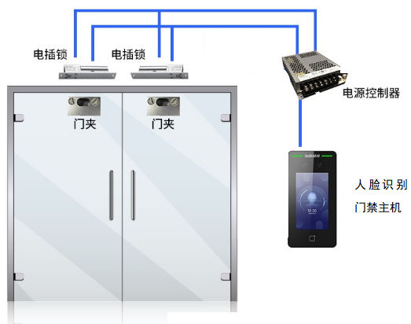

   A.手动控制、开环控制    

   B.自动控制、开环控制    

   C.手动控制、闭环控制    

   D.自动控制、闭环控制

   答案：B

   24\.如图所示智能泡脚桶，其水温控制装置能使水温保持在设定温度范围，其工作过程是：温度传感器检测实际水温，如果低于设定温度值，控制器控制电加热元件工作，使水温升高；如果达到或高于设定温度值，电加热元件停止工作。下列关于该控制系统说法正确的是(    )

   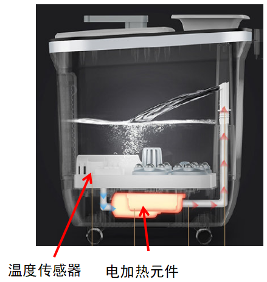

   A. 控制量是实时水温

   B. 水桶是被控对象

   C. 给定量是水量

   D. 电加热元件是执行器

   答案：D

   **二、综合题（共4题，每题10分，共40分）**

   （一）

   25\.某同学卧室储物空间不足，准备设计一个壁挂置物架。他从网上收集资料后，设计了如图1所示的折叠置物架。置物架展开时可放置书籍、笔记本电脑或生活用品等，不用时可折起来紧贴于墙壁，如图2所示。请根据以上材料，回答下列问题：

   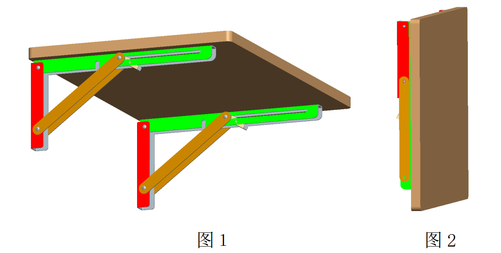
   
   图1 折叠置物架展开状态

   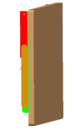

   图2 折叠置物架折起状态

   （1）该同学发现问题的途径是（   ）；

   A．上网搜集资料        B．观察日常生活         C．技术试验

   答案：Ｂ

   （2）该同学把置物架搁板的边角设计成圆角，该设计主要遵循（   ）；

   A．安全性原则         B．经济性原则    

   C．可持续发展原则     D．工程生理学原则

   答案：Ａ

   （3）如图3所示为置物架折叠结构示意图，根据图中标示的尺寸，孔槽Ｌ的长度至少为（   ）；

   A.120mm     B.155mm    C.160mm    D.200mm

   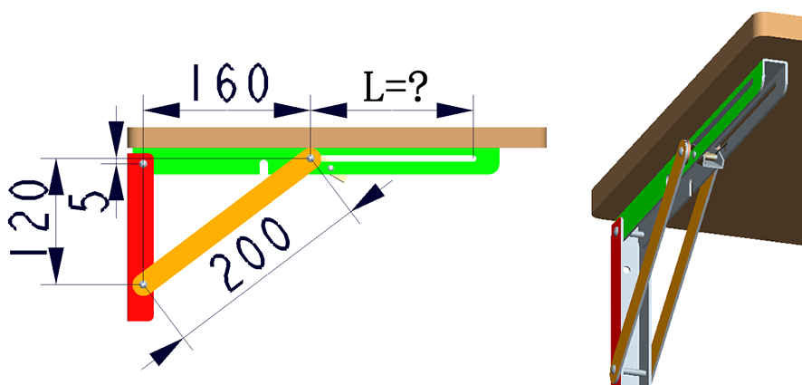

   图3

   答案：B

   （4）该同学对水平支撑杆进行优化，如图4所示，该优化的目的是（   ）；

   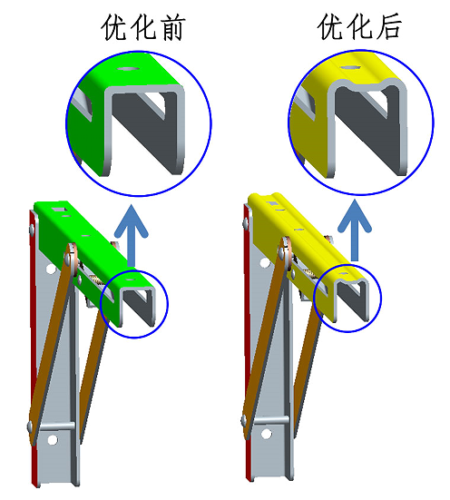
   
   图4 水平支撑杆优化

   A.增加美观性    B.增大强度    C.节省材料    D.增大摩擦力
   
   答案：Ｂ

（5）将置物架安装在混凝土墙上，最合适的连接件是（    ）。

   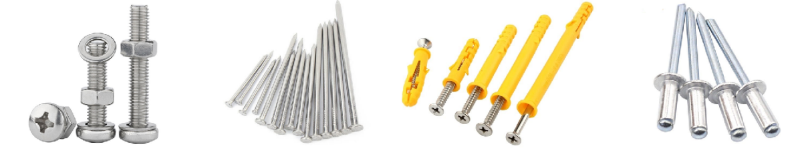
   
   A.螺栓和螺母         B.铁钉     C.膨胀管和自攻螺丝     D.铆钉

答案：Ｃ

26\.如图1所示，客家土楼产生于宋元时期，分布于潮湿多雨的南方地区，以石为基，以生土为主要原料，分层交错夯筑，配上竹木作墙骨牵拉，丁字交叉处则用木定型锚固。客家土楼遵循了“天人合一”的东方哲学理念，就地取材，选址或依山就势、或沿循溪流，建筑风格古朴粗犷，形式优美奇特，尺度适当，功能齐全实用，与青山、绿水、田园风光相得益彰，构成了人与自然和谐统一的景观。请根据以上材料，回答下列问题：

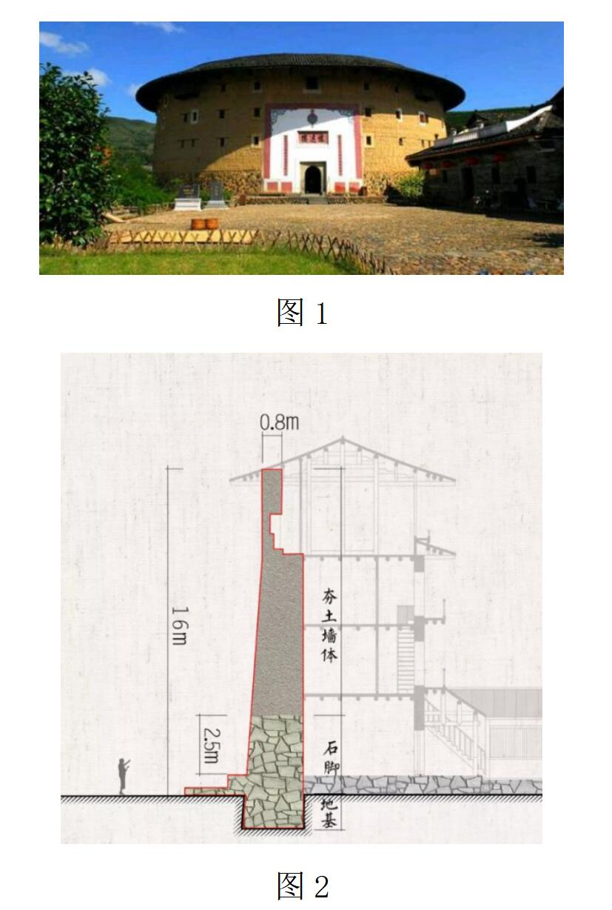

图1

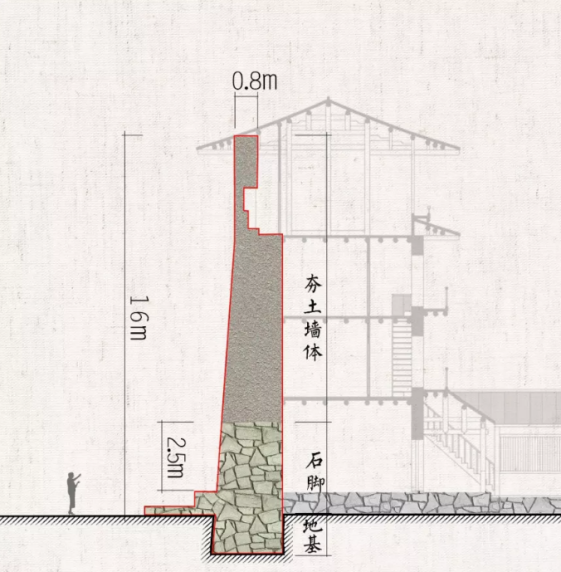

图2

（1）客家土楼墙体剖面如图2所示，墙体底部使用石头作为主材料，首要原因是\_\_\_\_\_\_\_；（防止鼠类挖掘/美化墙体外观/防止雨水冲刷）

答案：防止雨水冲刷

（2）如图3所示，土楼墙体采用基础扩展设计，相对于统一宽度设计，主要是通过\_\_\_\_\_\_（降低重心/增大支撑面/改变形状）来增强土楼的稳定性；

答案：增大支撑面

|  |
|:-----------------------------------------------------------------------------------------------------------------------------------------------------------------------------:|
|                                                                                                                                                                               |
| 图3                                                                                                                                                                            |

（3）下列关于墙体所用材料特性说法正确的是（   ）；

A．生土抗压、竹木抗压

B．生土抗压、竹木抗拉

C．生土抗拉、竹木抗拉

D．生土抗拉、竹木抗压

答案：B

（4）为避免土楼顶层屋檐横梁受压变形过大，设计了如图4所示的三种加固方案，最合理的是\_\_\_\_\_\_（方案1/方案2/方案3）；

答案：方案3

| 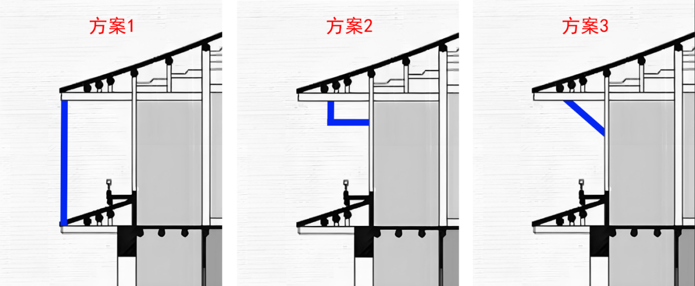 |
| -------------------------------------------------------------- |
| 图4                                                             |

（5）客家土楼采用圆形或方形的厚墙设计，具有良好的抗风和抗震性能。这是从\_\_\_\_\_\_\_（技术/文化）的角度对土楼进行评价。

答案：技术

27\.环境控制与生命保障系统是在太空密闭环境中为航天员创造适宜的工作和生活环境，保障航天员身体健康和生命安全的系统，被誉为航天员的生命“保护伞”。该系统工作流程如图所示。请根据以上材料，回答下列问题：

1. 该流程中，再生水经过水管理子系统得到饮用水、个人卫生用水、尿冲洗水以及\_\_\_\_\_\_\_（尿蒸馏水/电解制氧用水）；
   
   答案：电解制氧用水

2. 水处理子系统和微量有害气体去除子系统是\_\_\_\_\_\_\_（并行工序/串行工序）；
   
   答案：并行工序

3. 关于该流程说法正确的是（   ）；
   
   A.电解制氧用水经过电解制氧子系统只得到氧气
   
   B.二氧化碳去除子系统和二氧化碳还原子系统两个环节可以互换
   
   C.尿液经过尿处理子系统得到的残液，待下行销毁
   
   D.二氧化碳经过二氧化碳去除子系统能得到部分甲烷
   
   答案：C

4. 流程设计通常包含以下内容：①分析流程的各种因素，确定流程的各个环节；②模拟或测试流程的运行情况并进行改进；③了解设计的目的，明确设计目标；④写出说明书；⑤根据各环节之间的关系确定时序画出流程图。正确顺序是（   ）；
   
   A.③⑤②①④
   
   B.①⑤③②④
   
   C.③①⑤②④
   
   D.①②⑤③④
   
   答案：C

5. 优化该流程时，下列说法正确的是（   ）。
   
   A.不需要考虑环节之间的时序和内在逻辑关系
   
   B.为了提高效率，可以去掉二氧化碳去除子系统
   
   C.为了减少舱外环境污染，可以去掉微量有害气体去除子系统
   
   D.要分析流程相关的环境、设备、工艺条件等因素
   
   答案：D
   
   28\.某同学拟设计一个恒温孵化箱，传感器检测箱内温度，电路控制板根据传感器的反馈信号调整执行器输出，以保证箱内温度保持在设定的温度范围。控制系统方框图如下图所示。请根据以上材料，回答下列问题：
   
   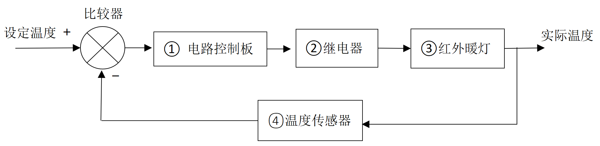
   
   （1）在控制系统中，负责将控制器发出的信号转换成能影响被控对象的信号的装置是\_\_\_\_\_\_\_（传感器/控制器/执行器），能对被控对象产生作用，使被控量发生变化的量，称为\_\_\_\_\_\_\_（控制量/给定量）。
   
   答案：执行器，控制量
   
   （2）该控制系统中，红外暖灯是\_\_\_\_\_\_\_（执行器/被控对象/被控量），被控量是\_\_\_\_\_\_\_（箱内温度/灯光）
   
   答案：被控对象，箱内温度
   
   （3）下列因素中，不属于该控制系统的干扰因素是（    ）：

6. 外部环境温度变化    B. 鸡蛋的数量    C. 电压波动
   
   答案：B

` `**15** / **15**
