# **广州市通用技术学业水平考试2024年B卷**
**一、单项选择题（共24题，每题2.5分，共60分）**

1\. 2024年6月25日，嫦娥六号携带从月球背面采集的土壤成功返回地球，这是中国航天技术的重大突破，也体现了技术的多种性质。下列关于嫦娥六号相关技术说法不正确的是（    ）

A. 成功采样并返回，体现了技术的目的性

B. 涉及航天、通信、材料、电子等多学科知识，体现技术的综合性

C. 在月球背面采样返回技术方面取得了重大的突破，体现了技术的创新性

D. 在月球正面和背面都可以接收到指挥系统的信息，体现了技术应用具有两面性

答案：D

2\.2024年，我国成功发射天舟七号货运飞船，展示了我国航天技术的强大实力。以下关于技术与人、自然、社会之间关系说法不正确的是（    ）

A.天舟七号的发射，为航天科研人员提供了宝贵的实践经验，体现了技术促进人类知识增长和技能提升方面的作用

B.天舟七号发射过程中，通过精确控制，实现了与空间站的顺利对接，这体现了技术与自然的和谐共处

C.天舟七号为空间站提供了必要的物资支持，满足了人类探索太空、进行科学实验的需求，推动了科学的发展和进步

D.天舟七号的研发带动了相关技术进步，促进了经济发展

答案：B

3\.某同学注意到学校图书馆的椅子久坐不适，决定设计一款舒适椅子。下列不属于制订椅子设计方案阶段的是(     )

A. 在制订设计方案之前需要进行市场调研，了解现有椅子的优缺点

B. 在方案构思之后进行方案筛选，确定最终的设计方案

C. 可以通过制作模型或原型来呈现构思的方案，并进行实际测试

D. 在设计过程中可能需要反复调整设计方案

答案：C

4\.设计师拟设计一款智能手表，集成了健康监测、通讯和娱乐功能。在设计这款智能手表的过程中，不需要考虑的限制因素是（    ）

A.销售价格

B.材料的可靠性

C.电池续航能力

D.手表的防水性能

答案：A

5\. 如图所示我国自主研发的第一代中远程轰炸机轰-6K，具备远程奔袭、大区域巡逻、防区外打击能力,是我国空军向战略空军转型的标志性装备之一。下列关于轰-6K说法不正确的是（    ）

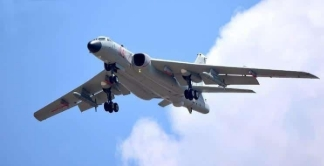

A. 配置新型火控雷达、搜索雷达，提升飞机的战斗性能，体现设计的创新性原则

B. 换装低油耗、重量轻的D-30KP-2涡扇发动机，从而减少燃油消耗和环境污染，体现了设计的可持续性发展原则 

C. 轰-6K的弹射救生系统经过重新设计，三名机组成员在弹射救生时依次以一定间隔向上弹射，极大地提高了弹射救生的成功率，体现了设计的安全性原则

D. 提供先进的驾驶舱配置，以提高飞行员的飞行体验，体现了设计的经济性原则

答案：D

6\. 设计师在构思一款家用智能扫地机器人时，参考仓库货运机器人的路径规划技术和避障算法进行改进。采用的构思方法是（    ）

A.列举法

B.移植借鉴法

C.黑箱法

D.筛选法

答案：B

7. 图1所示刨子是一种木工工具，包括刨身、刨刀片和楔木等部件，用于平整木材表面。图2是某学生用3D建模设计的刨身模型立体图，根据图3判断，正确的左视图是（     ）

   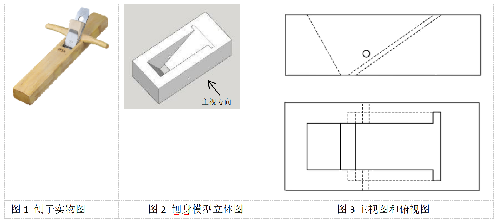
   
   图1 刨子实物图

   

   图2 刨身模型立体图

   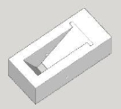

   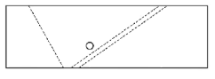

   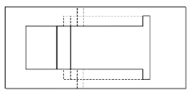

   图3 主视图和俯视图

   | A. | 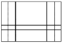 |
   | --- | --- |
   | B. | 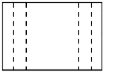 |
   | C. | 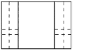 |
   | D. | 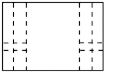 |

   答案：D

   8\.下列尺寸标注不规范的有（     ）

   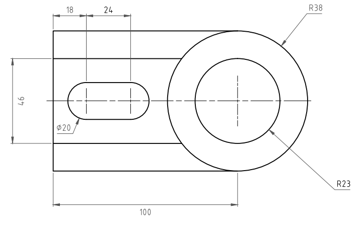

A. 2处
B. 3处
C. 4处
D. 5处

   答案：D

   9\.如图所示为某直流小电机的驱动电路图，以下说法正确的是（     ）

   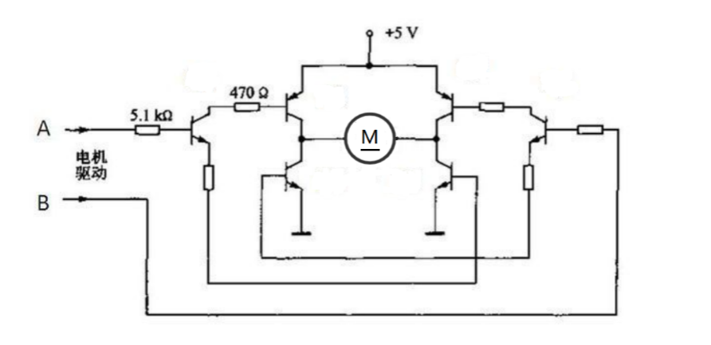

A. 该电路中用到的三极管不是同一种类型
B. 该电路有用到二极管
C. 该电路有用到可调电阻
D. 该电路中的电阻大小一样

   答案:A

   10\.某同学准备制作如图1所示的书架，现在把一块厚度和大小满足要求但表面粗糙的实木板加工成如图2所示的构件（需要预制孔位），下列不需要用到的工具是（     ）

   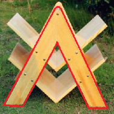
   
   图1 书架

   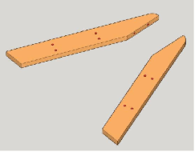
   
   图2 构件

A. 锯子 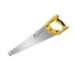  
B. 电刨 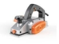
C. 凿子 
D. 台钻 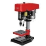

   答案：C

   11\. 加工如图所示的金属工件，下列说法正确的是（     ）

   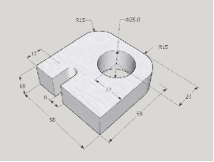

   A. 锉削外部圆角和内部圆孔时，均选用圆锉

   B. 加工U型槽部位时，应先钻孔再锯割

   C. 使用台钻钻孔前，要用样冲冲眼，用台虎钳固定工件

   D. 锉削后，禁止用嘴吹切屑，应用手清除

   答案：B

   12\.要制作如图所示的透明相框，要求不易破碎，且两块相框板能直接吸附，方便拆装。下列材料中不适用的是（    ）

   

A. 亚克力板       B. 强磁铁          C.普通玻璃          D.  金属杆

   答案：C

   13\.锂电池在出厂前需要进行一系列的测试，以保证其性能和安全性。下列关于锂电池测试的说法不正确的是（    ）

   A.通过长时间静置或低电维持，测试电池的老化和自放电性能属于老化试验

   B.在不同温度、湿度、盐雾等环境条件下测试电池的性能，以评估其在各种环境温度下的工作能力属于环境适应性测试

   C.测试电池的抗冲击、振动等属于寿命测试

   D.满电的电池或电池组从高处自由落体跌落试验属于安全性测试

   答案：C

   14\.小刘发明了一种新型节能灯具，获得了实用新型专利。下列行为属于侵犯小刘专利权的是（    ）

   A.小陈按照小刘的专利制作了一个相同的灯具供个人使用   

   B.某公司在专利保护期限内未经许可的情况下，生产并销售这种灯具

   C.小李制作了该产品的使用测评视频，并发布到网络上

   D.小赵从小刘的专利产品获取灵感，开发出新产品并成功申请到专利

   答案：B

   15\.如图所示为某款可折叠、可拆卸的便携式露营桌,下列说法不正确的是（    ）

   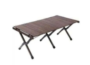

A. 该露营桌的支撑主体是框架结构
B. 两根支撑脚之间结点属于铰结点

   C. 桌面经炭化处理后防虫防腐，适合户外环境使用

   D. 支架与桌面之间适合用膨胀螺栓连接

   答案：D

   16\.如图所示，斗拱是由方形的斗、升、拱、翘、昂组成，是较大建筑物的柱与屋顶间之过渡部分。下列关于斗拱的说法不正确的是（    ）

   A. 斗拱的使用降低了建筑的重心，增强了建筑的稳定性

   B. 通过分散荷载到多个支撑点，使建筑物更稳固

   C. 斗拱的众多构件层层外挑，增加了承托面积

   D. 能够在地震时通过变形吸收部分能量，起到减震作用

   

   答案： A

   17\.如图所示，海心桥位于广州市珠江上，是一座集交通、观景于一体的人行桥。该桥以其独特的设计和优美的曲线成为城市的新地标。海心桥全长488米，主跨为240米，桥面宽度为15米，采用钢桁架结构，桥身线条流畅，与周围环境和谐相融。下列关于海心桥的说法不正确的是（   ）  

   

   A.钢桁架结构不仅具有高强度和耐久性，还能够有效承受各种荷载，包括行人荷载、风荷载和可能的地震荷载，实现了结构的安全性目标

   B.设有坡道和电梯，满足无障碍通行，体现人性化设计理念

   C.融合了广州文化，其曲线和流畅线条展现了岭南水乡特色，与城市历史和文化相协调，成为城市文化的一部分，提升了城市的文化品位和形象

   D.主要是为了解决行人通行不便的问题，设计时无需考虑周边店铺的经济等因素

   答案：D

   18\.如图所示某茶叶厂的生产流程图，下列分析正确的是（　　）

   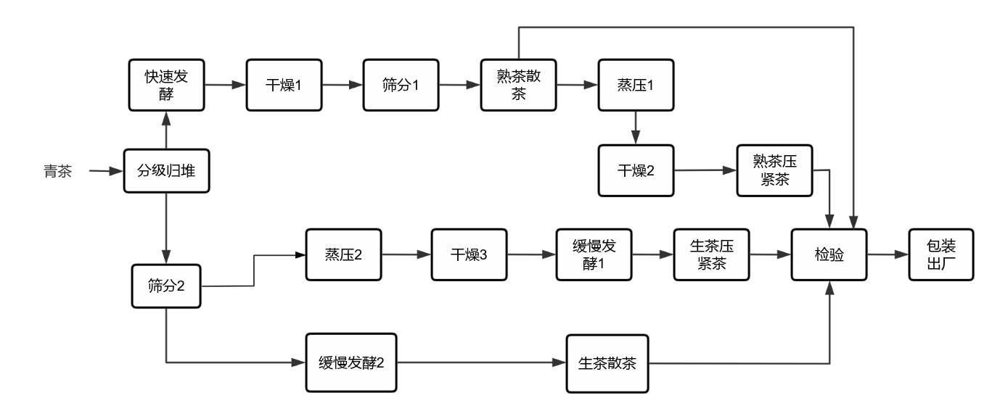

   A．为了节约时间，缓慢发酵1环节和缓慢发酵2环节可以合并

   B．缓慢发酵1环节和蒸压2环节的时序可以颠倒

   C．设置检验环节是为了保证产品质量

   D．四种茶的生产都需要经过蒸压环节

   答案：C

   19\.某装修公司翻新改造卫生间的工作流程如图所示，下列描述不正确的是（   ）

   

   A.拆除旧设施和管线开槽环节的时序不能颠倒

   B.插座定位和水点定位是并行工序

   C.管线开槽和管线敷设是串行工序

   D.电热毛巾架安装完成后才能安装马桶

   答案：D

   20\.某脱水蔬菜生产工艺流程如图所示，生产的脱水蔬菜有杂质和霉变，为解决脱水蔬菜的质量问题，可对该生产工艺流程进行改进和优化，以下措施不合理的是（   ）

   

A. 为清理杂质和变质的蔬菜，在清洗之后增加二次筛选 
B. 为保障干燥度达标，在干燥之后进行蔬菜水分检测 
C. 为提高生产效率，干燥时使用100℃高温快速干燥 
D. 为保障产品质量，在包装之前增加质量检测环节

   答案：C

   21\.某款无土栽培的营养液循环控制系统如图1所示，由微控制器、环境感知部分和调节部分组成，通过温度传感器、液位传感器、pH值传感器和流速计采集数据，由微控制器调控加热器、制冷器、蠕动泵和水泵联合调节栽培槽中营养液的温度、pH值、液位和流速，系统功能结构如图2所示。从系统分析的角度来看，下列说法不正确的是（   ）

   |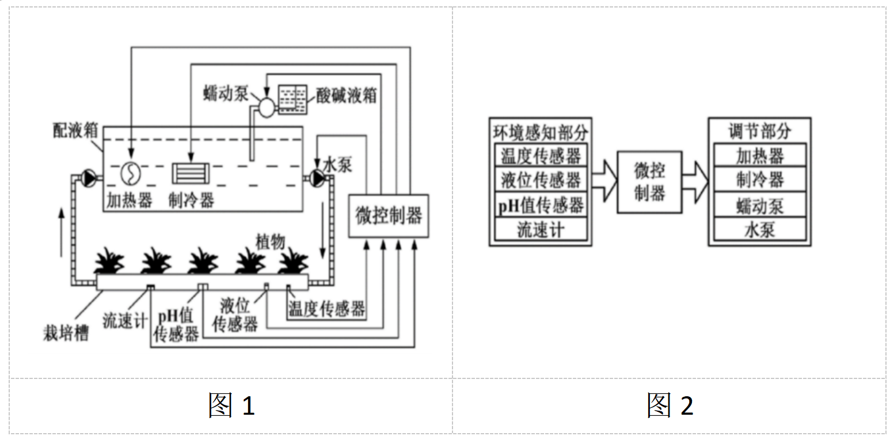|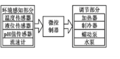|
   | :-: | :-: |
   |图1|图2|

   A.环境感知部分会影响微控制器的调节作用，体现了系统的整体性

   B.该系统中的液位控制和pH值控制之间相互影响，体现了系统的相关性

   C.无论环境温度如何变化，该系统能够调节营养液温度到设定值，体现了系统的环境适应性

   D.该系统可以通过微控制器调节加热器和制冷器实现保温，体现了系统的功能性

   答案：A

   22\.如图所示某零件分选系统，检测装置检测输送带上零件的质量，剔除装置将不合格的零件推至废料筐。为提高零件分选的效率，对该系统进行优化，下列不属于影响系统优化的因素是（   ）

   |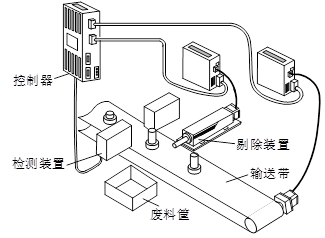|
   | :-: |

A. 检测装置的检测精度
B. 输送带的传输速度
C. 剔除装置的推杆速度
D. 废料筐的重量

   答案：D

   23\. 如图所示某杂粮定量控制系统，加料时，传感器获取称料斗中的料量信息，并传送给控制器，与设定料量比较，当称料斗中的实际料量达到设定料量时，进料阀关闭。该杂粮定量控制系统是（    ）

   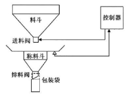

   A.手动控制、开环控制	

   B.自动控制、开环控制	

   C.手动控制、闭环控制	

   D.自动控制、闭环控制

   答案：D

   24\.如图所示某款电热水器，它的温度控制系统工作原理：测温器检测水温并将数据反馈给温控器，根据设定的水温和实际出水温度的差值，温控器控制加热管加热水箱中的水，最终使出水温度维持在设定范围。关于该控制系统，下列说法不正确的是（    ）

   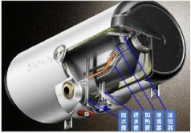

   A.出水量是被控量

   B.预设的水温是给定量

   C.测温器是反馈装置

   D.发热量是控制量

   答案：A

   **二、综合题（共4题，每题10分，共40分）**

   （一）

   25．某同学发现下雨时食堂、教室等场所雨伞摆放凌乱，决定设计一款雨伞架来解决这个问题。

   经过分析，该同学提出下列设计要求：

   ①雨伞架的高度应满足市面上大部分长柄伞和折叠伞的尺寸需求；

   ②雨伞架能折叠，折叠后占用空间少，外形美观；

   ③防止生锈，主框架选用不锈钢方管。

   `　　`经过构思，该同学设计了如图１所示的雨伞架。

   
   
   展开状态

   
   
   折起状态

   图１ 雨伞架

   请根据以上材料，回答下列问题：

   （1）该设计问题的来源是（　　）；

   A.人类生存必须要解决的问题

   B.用户指定的问题

   C.设计者主动发现的问题

   答案：Ｃ

   （2）如图２所示为雨伞架折叠结构示意图，根据图中标示的尺寸，孔槽Ｌ的长度至少为（　　）；

   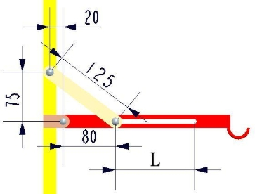

   图２

   A.80mm    B.100mm   C.120mm   D.125mm

   答案：C

   （3）该同学测试时发现雨伞滴下来的水会把地面弄湿。于是他在原方案基础上增加了一个接水盘，如图3所示。接水盘能够展开和收起，设计有带塞子的排水口，积水可以集中排放。该接水盘的设计体现了（　　）；

   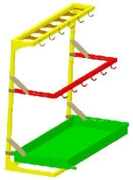

   图３

   A．可持续性发展原则  　B．经济性原则  　C．实用性原则

   答案：C

   （4）对该雨伞架进行测试，下列方案不合理的是（　　）;

   A. 人踩在雨伞架上，观察其各部件是否变形

   B．在挂雨伞的各个钩子处挂上1L的矿泉水，测试其稳固程度

   C．反复折叠，测试其开合流畅度

   D．向接水盘倒水，进行排水测试

   答案：Ａ

   （5）雨伞架制作过程中，要按图4对不锈钢方管进行切割，再进行90°直角弯折，其加工流程为：划线－锯割－弯折－焊接。某同学切割弯折后发现缝隙很大，如图5所示，造成这种情况可能的原因是（   ）。

   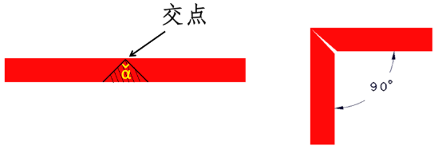

   图4                                      图5

   A．划线交点没到边界线 

   B．两条划线的夹角小于90° 

   C．锯割时锯偏，导致α角过大 

   D．不锈钢方管弯折没到位

   答案C

   26．如图1所示某公路边上的悬臂式挡土墙示意图，由底板和固定在底板上的直墙构成，其主要靠底板上的填土重量来维持稳定。

   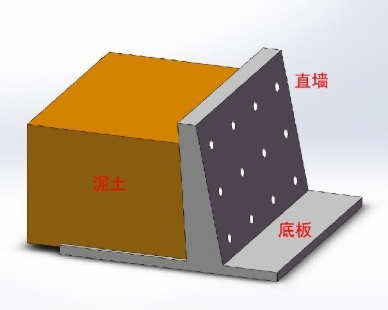

   图1

   请根据以上材料，回答下列问题：

   （1）挡土墙的直墙上设置有多个孔洞，主要的作用是         （节约建材/美化外观/排水泄压）；

   答案：排水泄压

   （2）如图2所示，悬臂式挡土墙在泥土端采用宽底板的设计，相对于采用短底板设计，主要是为了通过            来增强挡土墙的稳定性（降低重心/增大支撑面/改变形状）；

   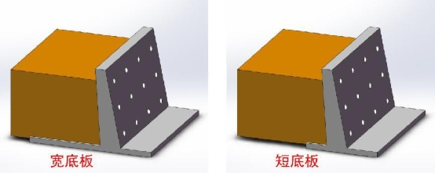

   图2

   答案：增大支撑面

   （3）为提高挡土墙的强度，墙体采用钢筋混凝土结构。该设计利用材料的特性是（   ）；

   A．钢筋抗压、混凝土抗压

   B．钢筋抗压、混凝土抗拉

   C．钢筋抗拉、混凝土抗拉

   D．钢筋抗拉、混凝土抗压

   答案：D

   （4）为了优化该悬臂式挡土墙，构思设计了如图3所示的两种扶壁式挡土墙方案，关于这两个方案，下列说法正确的是（    ）；

   A.方案1结构强度更大，方案1的外部空间利用率更大

   B.方案1结构强度更大，方案2的外部空间利用率更大

   C.方案2结构强度更大，方案1的外部空间利用率更大

   D.方案2结构强度更大，方案2的外部空间利用率更大

   答案：C

   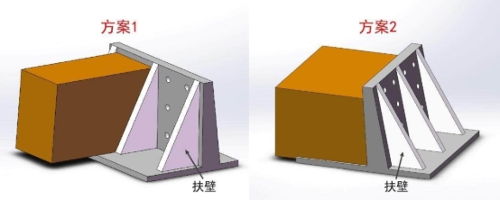

   图3

   （5）扶壁式挡土墙是一种薄壁式挡土墙，其主要特点是构造简单、施工方便，墙身断面较小，自身质量轻，可以较好的发挥材料的强度性能，能适应承载力较弱的地基。这是从\_\_\_\_\_\_\_\_（技术/文化）的角度对扶壁式挡土墙进行评价。

   答案：技术

27. 为实现厨余垃圾集中处理，保证餐厨垃圾得到资源化、无害化和减量化处理，某地建设了餐厨垃圾处理站，该处理站餐厨垃圾处理流程如图所示。 

    

    请根据以上材料，回答下列问题：

1. 该流程中，餐厨垃圾经过处理得到的粗大杂物、小块杂物和      （轻相/渣相）可焚烧发电；

   答案：渣相

1. 除砂装置和焚烧发电的工序关系是               （并行工序/串行工序）；

   答案：串行工序

1. 关于该流程说法正确的是（    ）；
1. 油脂提取系统和沼气收集及脱硫系统两个环节可以互换
1. 经过处理得到的水相不能进行资源再利用
1. 经过油脂提取系统处理得到的产物全部通过卫生填埋处理
1. 经过除臭系统处理最终可以使排放的气体达到标准

   答案：D

1. 流程设计时，通常包含以下内容：①分析流程的各种因素，确定流程的各个环节；②模拟或测试流程的运行情况并进行改进；③了解设计的目的，明确设计目标；④写出说明书；⑤根据各环节之间的关系，确定时序，初步画出流程图。正确的顺序是（  ）；
1. ①⑤③②④
1. ③①⑤②④
1. ①②⑤③④
1. ③⑤②①④

   答案：B

1. 关于该流程的优化，下列说法正确的是（  ）。
1. 该流程的优化不需要了解各环节前后顺序的关系
1. 为了实现工期优化，可以将两个回用环节合并
1. 为了实现成本优化，可以将除臭系统去掉
1. 在进行优化时，要分析与流程有关的环境、设备、工艺条件等因素

   答案：D

   28\. 无人机广泛应用在多个领域，无人机飞行控制系统是无人机的核心技术之一，主要由传感器、控制器和执行机构组成，传感器负责收集无人机姿态、速度、高度等信息，控制器根据这些信息发出控制指令，通过执行机构驱动无人机进行相应的动作，实现无人机自主飞行、定位和避障等功能。

   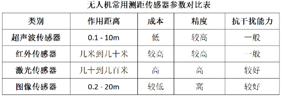

   无人机飞行过程中面临着各种障碍物，如建筑物、树木、电线杆等，这使得自主避障成为无人机安全飞行的关键需求。完善的自主避障系统能够在很大程度上减少因操作失误造成的无人机损坏、伤及人身、建筑物事故发生率。

   请根据以上材料，回答下列问题：

1. 若要自制一款具有自主避障功能的无人机，综合考虑成本、精度和抗干扰能力，测距传感器应优先选择\_\_\_\_\_\_\_\_\_\_（红外传感器/超声波传感器/激光传感器/图像传感器）

   答案：图像传感器

1. 如图1所示，无人机灯光秀时，无人机群采用编队飞行，其控制方式属于\_\_\_\_\_\_\_\_\_\_（手动控制/自动控制），被控量是\_\_\_\_\_\_\_\_\_（预设图案/灯光效果）。

   

   图1

   答案：自动控制、预设图案

1. 如图2所示，无人机自主跟随时，无人机上的摄像头不断地采集目标的图像信息，经过图像处理算法，对目标进行识别和追随跟踪，此控制过程属于\_\_\_\_\_\_\_\_\_\_（开环控制/闭环控制）； 

   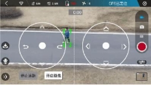

   图2

   答案：闭环控制

1. 如图3所示，无人机往前飞行遇到障碍物时，依照设定将自动进入避障功能（刹车并保持悬停），无人机在悬停过程中属于干扰的是\_\_\_\_\_\_\_\_\_\_（阵风、电机故障、障碍物大小）

   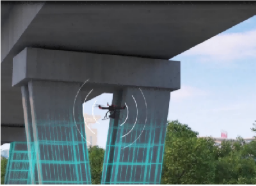

   图3

   答案：阵风
` `**16** / **16**

